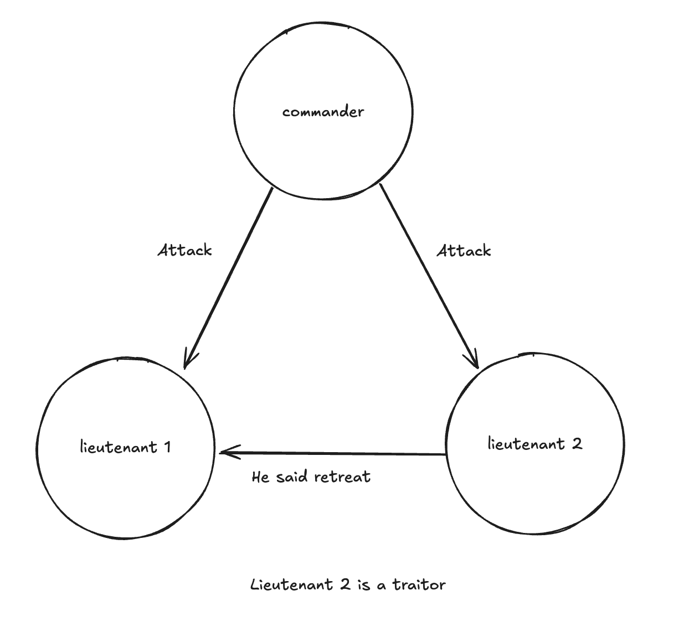
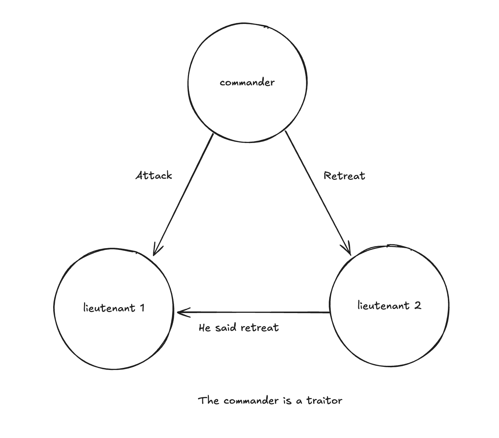
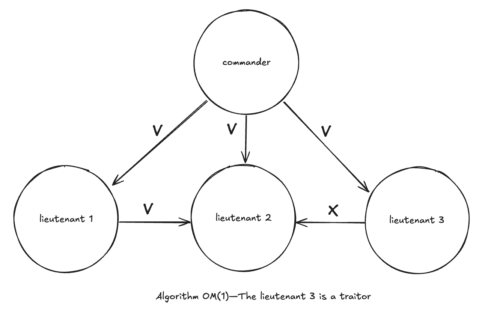
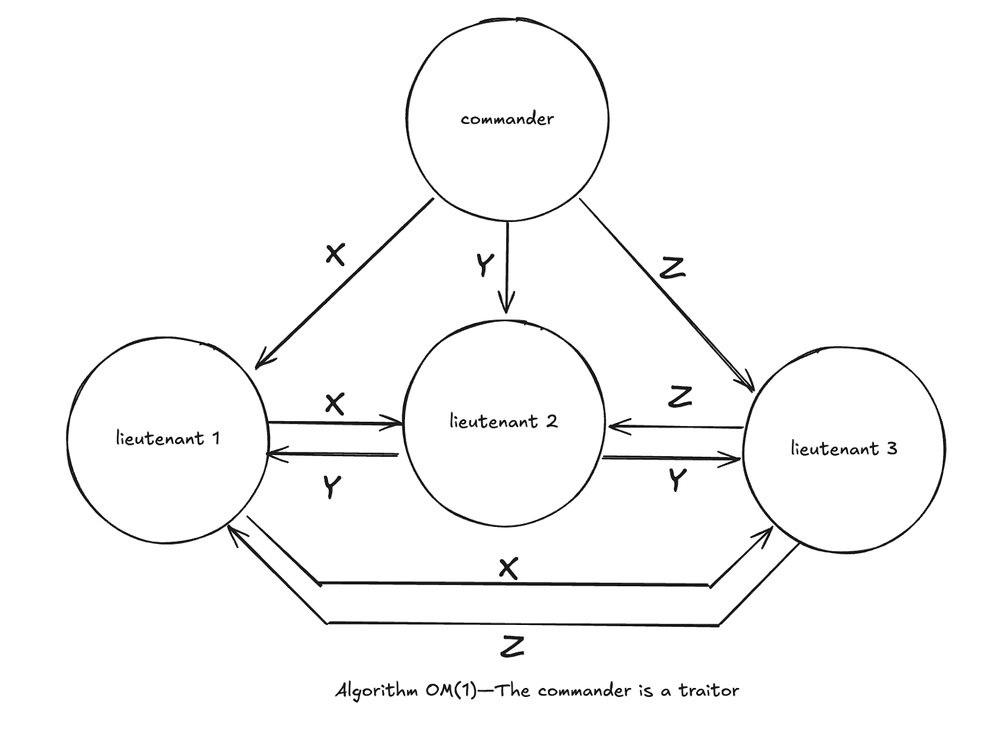
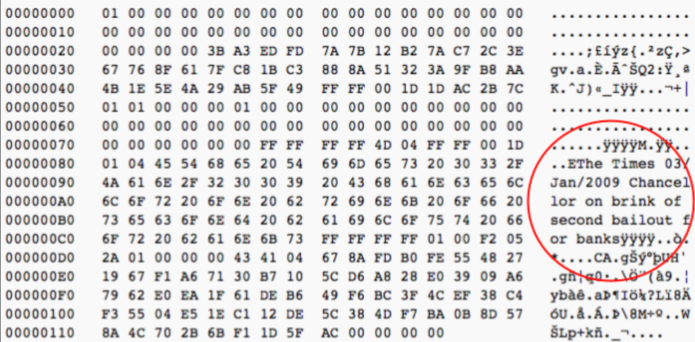

# 1. Why Bitcoin Matters

"A mysterious new technology emerges, seemingly out of nowhere, but actually the result of two decades of intense research and development by nearly anonymous researchers. Political idealists project visions of liberation and revolution onto it; establishment elites heap contempt and scorn on it. On the other hand, technologists – nerds – are transfixed by it. They see within it enormous potential and spend their nights and weekends tinkering with it.
Eventually mainstream products, companies and industries emerge to commercialize it; its effects become profound; and later, many people wonder why its powerful promise wasn’t more obvious from the start. What technology am I talking about? Personal computers in 1975, the Internet in 1993, and – I believe – Bitcoin in 2014."

—[Marc Andreessen](https://archive.nytimes.com/dealbook.nytimes.com/2014/01/21/why-bitcoin-matters/), Founder of Netscape, 2014


## 1.1 Introduction to Bitcoin Technology

One way to think of Bitcoin is as a sequence of atomic transactions. Each transaction is authenticated by a sender with the solution to a previous cryptographic puzzle that was stored as a script, using the Bitcoin Script programming language.

The new transaction is locked to the recipient with a new cryptographic puzzle that is also stored as a script, whose new owner possesses the solution to unlock future transfers.

Each transaction is recorded in the global public and immutable ledger, the blockchain. Only the owner of the private keys that generated the address where the bitcoins are located can unlock the value to be moved forward.

We use "Bitcoin" with an uppercase B when referring to the network, the system itself. "bitcoin" with a lowercase b refers to the currency, the values transferred through this system.

## 1.2 Attributes of the Bitcoin Network

- **Security**: The Bitcoin network is secure as long as more than 50% of participating nodes are honest.
- **Reliability**: The network state is maintained by all nodes, which distribute the ledger copy among themselves.
- **Decentralization**: All network nodes replicate transaction records, ensuring data distribution.
- **Peer-to-Peer Transactions**: Allows direct transactions between users without intermediaries or central authorities.
- **Accessibility**: Anyone can join or leave the network, validate transactions, or mine new coins at any time.
- **Transparency**: All transactions are publicly verifiable and available to all network operators.
- **Permissionless**: No credentials, identifications, or authorizations are required to participate in the network.
- **Globality**: The network operates without geographical restrictions and can be accessed from almost anywhere in the world.
- **Censorship Resistance**: There is no central authority that can prevent fund transfers between users.
- **Neutrality**: The network is indifferent to who, what, when, where, or why you are sending and receiving bitcoin.
- **Controlled and Distributed Supply**: Bitcoin generation is self-regulated by mathematical algorithms and game theory models, ensuring a fair and predictable process.

## 1.3 Bitcoin and Human Rights

Despite short-term Bitcoin volatility and the need for digital literacy for full use, Bitcoin offers significant benefits for human rights and financial inclusion, especially where traditional alternatives are limited or ineffective. Here’s why Bitcoin matters for human rights.

### Alternative to the Current System
Most of humanity's dramas, such as endless wars, are due to money being manipulable, arbitrarily printed, and allocated for such purposes without the general population's consent. Bitcoin solves this with its transparent monetary policy and inelastic supply defined by the community at the code level.

### Financial Inclusion for the Unbanked
Approximately 1.7 billion people worldwide lack access to traditional banking services. Bitcoin offers a viable alternative, requiring only internet access and a mobile device to participate in the financial network. In regions like Sub-Saharan Africa, where banking infrastructure is limited, Bitcoin usage is growing as a way to access financial services.

### Financial Freedom and Protection from Oppressive Regimes
In some countries, authoritarian governments can freeze bank accounts or confiscate assets arbitrarily. Bitcoin offers a way to protect assets from these actions. In countries with political or financial instability, such as Venezuela, individuals use Bitcoin to safeguard their wealth from hyperinflation and government control.

### Facilitation of International Remittances with Lower Fees
Traditional money remittances, especially to developing countries, can have high fees and take days to process. Bitcoin allows near-instant transfers with much lower fees. Migrant workers sending money to their families can use Bitcoin to avoid high fees from services like Western Union, increasing the amount of money reaching the final recipients.

### Personal Control Over Financial Resources
With Bitcoin, individuals have full control over their funds without needing intermediaries. This ensures greater autonomy and security in their financial transactions. In crisis situations, such as natural disasters or conflicts, where banks may be inaccessible, people can still access and use their funds with Bitcoin.

### Transparency in Transactions and Fraud Prevention
The Bitcoin blockchain is an immutable public record of all transactions, reducing fraud possibilities and increasing transparency. Human rights organizations can use Bitcoin to receive donations transparently, allowing donors to see exactly how funds are used.

### Incentive for Renewable Energy Use and Community Development
Bitcoin mining encourages the construction of electrical infrastructure in underdeveloped or hard-to-reach areas. The process has incentivized the use of renewable energy sources and innovation in energy efficiency, as miners seek cheaper and sustainable energy to maximize profits. Clean energy sources can enter negative pricing periods when production exceeds demand. In these moments, Bitcoin miners can use the excess energy to regulate grids, utilizing the energy and avoiding losses. Bitcoin mining can act as a flexible load, absorbing excess energy during production peaks and shutting down when demand increases.

### Savings Method
Bitcoin is the best investment of all time and the best way to preserve purchasing power in the long term as fiat currencies are diluted by inflation. It is an extremely effective long-term savings tool as a scarce digital asset. Furthermore, most people do not have access to the stock market to preserve and grow their income.

### Physical Money and Transaction Privacy are Disappearing
What happens when all our financial activity is trackable by a centralized entity, and we lose the financial privacy of physical money? What powers do governments and corporations gain when we trade our privacy and freedom for convenience? Each financial transaction reveals a vast amount of information about you, enabling control by corporations and governments, censorship of your transactions, and enabling surveillance and social engineering.

**Bitcoin has been considered one of the main tools for guaranteeing human rights today. It is, in fact, a tool of freedom, especially useful in dictatorial countries with strict financial control of their citizens' bank accounts.**

Bitcoin offers humans money that cannot be censored by authorities, cannot be devalued by governments, cannot be monopolized by corporations, cannot be easily mass-monitored, cannot be stopped by borders, and can be accessed by anyone. And that’s why Bitcoin matters for human rights.

*"Few people are looking at the intersection of monetary freedom and real freedom." —Alex Li, Bitcoin Development Lead, Human Rights Foundation*

*"Bitcoin is collaborative, decentralized, and aligns very well with the human rights movement." —Alex Gladstein, CSO, Human Rights Foundation*

*"Bitcoin is terrible for dictators." —Alex Gladstein, CSO, Human Rights Foundation*

Recommended Reading: [Check Your Financial Privilege](https://www.amazon.com.br/dp/B0B1RDWHLN?ref=cm_sw_r_cp_ud_dp_YS9TT7NY1W6QT5SA0H8T&ref_=cm_sw_r_cp_ud_dp_YS9TT7NY1W6QT5SA0H8T&social_share=cm_sw_r_cp_ud_dp_YS9TT7NY1W6QT5SA0H8T).

## 1.4 The Byzantine Generals Problem

Bitcoin emerged as a solution created by Satoshi Nakamoto to address the Byzantine Generals Problem.

The Byzantine Generals Problem is a classic issue in computer science, specifically in the area of fault tolerance within distributed computing and distributed systems theory. It was first proposed by Marshall Pease, Robert Shostak, and Leslie Lamport in 1982, "expressed abstractly in terms of a group of Byzantine army generals camped with their troops around an enemy city."

In this scenario, a traitor (whether the Commander or a Lieutenant) prevents the group from reaching consensus. In a financial ledger, think of the traitor as a malicious party aiming to facilitate fraudulent transactions. As the number of parties in the system increases, the number of communication channels (and opportunities for distrust) increases exponentially. Imagine the complexity of building consensus with thousands or millions of parties involved. The following schemes are attributed to [Lamport, Shostak, Pease, 1982](https://www.andrew.cmu.edu/course/15-749/READINGS/required/resilience/lamport82.pdf)









The solution to the Byzantine Generals Problem consists of combining probabilistic work (trial and error) in discovering the nonce that generates a hash equal to or below the difficulty level defined in the mining process, plus selecting the chain with the highest cumulative proof-of-work, meaning the greatest computational power employed to form it.

Bitcoin also solves the double-spending problem, ensuring that a digital asset (bits) cannot be duplicated or subject to copy-paste.

## 1.5 Bitcoin Whitepaper

### Definição de Whitepaper
A whitepaper is an informative and technical document that presents the vision, methodology, and details of a project or technology, serving as a guide to understand its fundamentals and objectives.

The Bitcoin whitepaper, titled ["Bitcoin: A Peer-to-Peer Electronic Cash System"](https://bitcoin.org/bitcoin.pdf), was released by Satoshi Nakamoto on October 31, 2008. It was published on a cryptography mailing list called ["The Cryptography Mailing List"](https://www.metzdowd.com/pipermail/cryptography/2008-October/thread.html) on the website metzdowd.com, detailing the structure and operation of a decentralized electronic payment system.

This document introduced innovative concepts that revolutionized the global financial system and have been used in various ways for the development of thousands of other cryptocurrencies and blockchain technologies.

It all started with Bitcoin, which remains the most important, decentralized, and robust candidate for a global financial system and store of value without a central authority. Many consider all other cryptocurrencies as centralized attempts to counterfeit Bitcoin.

In fact, governments are migrating their financial systems to CBDCs (Central Bank Digital Currencies), systems inspired by Bitcoin technology but allowing for extreme surveillance and Orwellian control, as they operate through centralized control.

Since Bitcoin is open-source, anyone can copy its ideas and build new systems. However, only the Bitcoin derived from Satoshi Nakamoto's first version is a true peer-to-peer electronic cash system.

The Bitcoin software was released by Satoshi Nakamoto on January 3, 2009. On that day, Satoshi mined the genesis block, the first block of the Bitcoin blockchain, officially marking the beginning of the Bitcoin network.

### Message in the Genesis Block

In the genesis block, Satoshi Nakamoto left a significant message: "The Times 03/Jan/2009 Chancellor on brink of second bailout for banks."

 ```The Times 03/Jan/2009 Chancellor on brink of second bailout for banks ```



This message is a reference to the headline of the British newspaper "The Times" on January 3, 2009, highlighting the global financial crisis and the imminent second bailout of banks by the government. Including this message was an implicit critique of the traditional financial system and a statement of intent regarding the need for an alternative, decentralized financial system resistant to manipulation and government intervention.

### Negative Consequences of a Second Bank Bailout

#### Economic Inequality

Bank bailouts often benefit large financial institutions and their stakeholders, while the general population bears the costs through taxes and austerity. This can increase economic inequality as public resources are used to save wealthy private entities.

#### Moral Hazard

Bailouts encourage banks to take excessive risks, knowing they will be saved in case of failure. This risky behavior can lead to irresponsible practices, increasing the likelihood of future financial crises.

#### Increase in Public Deficit

The use of public resources for bailouts increases government debt, potentially resulting in austerity measures, cuts in essential public services, and tax increases, directly affecting the quality of life of the population.

#### Erosion of Public Trust

The perception that banks are favored by the government can erode public trust in the financial system and economic justice, generating social discontent and a possible loss of legitimacy of institutions.

#### Social Impacts

Printing money to finance bailouts can lead to inflation, reducing the population's purchasing power. Austerity measures and cuts in public services can result in unemployment and a broader economic crisis, directly affecting people's lives.

These consequences illustrate how bank bailouts can have profound and lasting impacts on society, exacerbating inequalities and creating additional risks for long-term economic stability.


