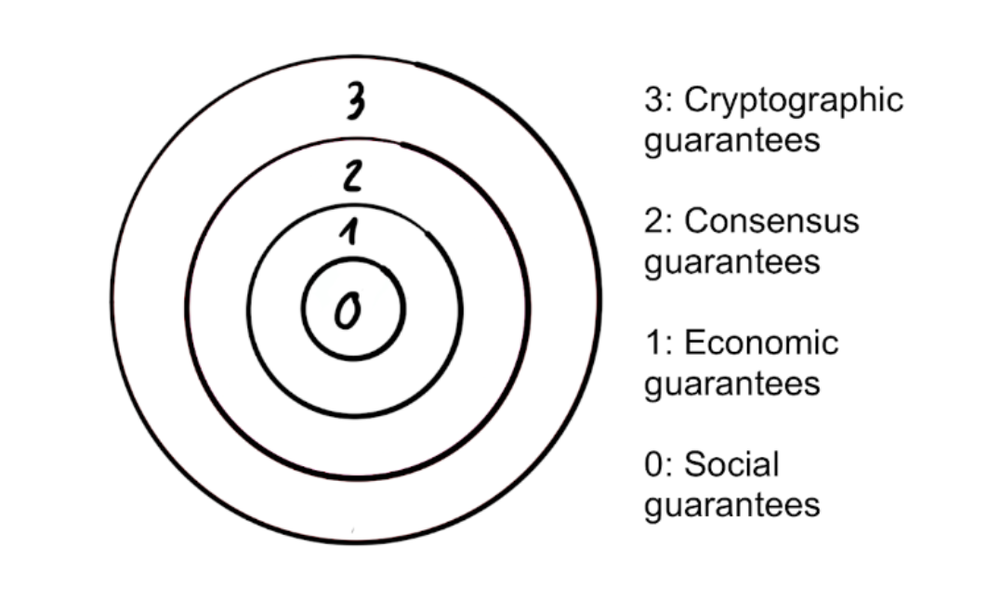
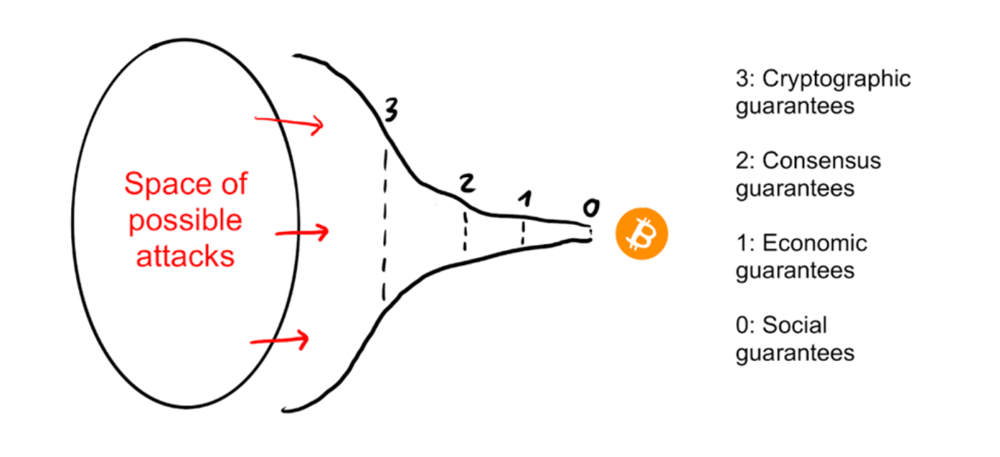
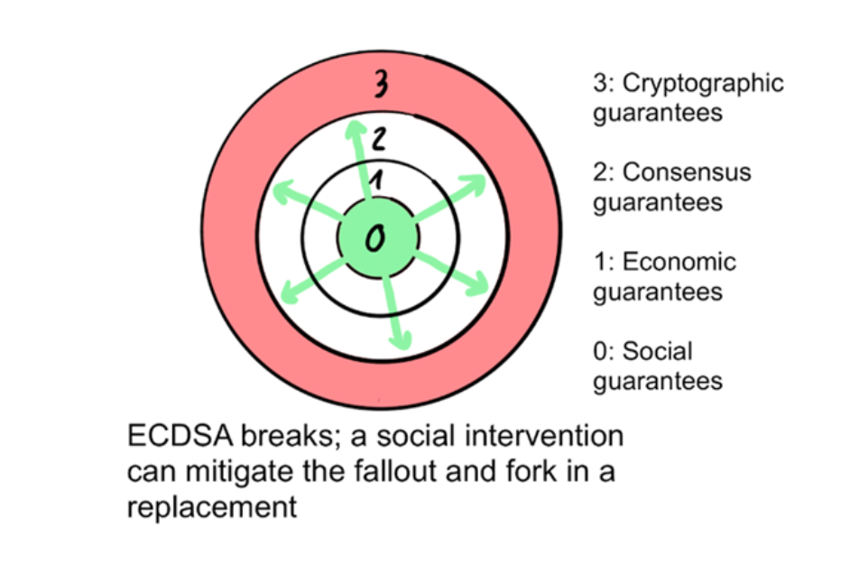
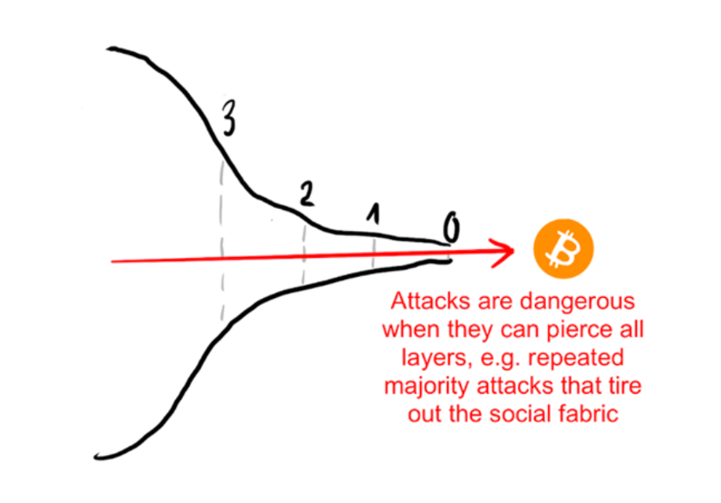

# 2. Bitcoin and Cryptography

## 2.1 Blockchain: Bitcoin's Ledger

A blockchain is a distributed database that stores information securely and transparently, functioning as a digital ledger where data is organized into cryptographically linked blocks.

Each block contains a record of transactions, a timestamp, and a reference to the previous block, ensuring data immutability since any change in a block would affect the entire chain.

To witness and store Bitcoin's blockchain, you start by downloading the reference client software—Bitcoin Core. This software downloads the entire blockchain, the ledger of all transactions in Bitcoin's history. Each full Bitcoin client stores a complete record of all Bitcoin transactions ever made, without a central registrar, just a set of distributed copies among all clients.

After downloading and validating the blockchain history, the question of synchronization arises: how to keep these blockchain copies synchronized with each other and achieve distributed consensus without a definitive central entity? When a client receives conflicting messages about a transaction, which one should it accept? The solution lies in the stack of cryptographic technologies and consensus rules used in the system.

Downloading the Bitcoin client software is not mandatory to use bitcoin. A simple free wallet app on a mobile phone is enough to get started. However, installing and maintaining nodes is recommended for users who want to verify their transactions privately and participate in the consensus process. Full nodes are also important tools for developers and advanced users.

Recommended reading: 



## 2.2 Consensus Rules

Consensus rules define what Bitcoin software does and how. These rules are fundamental to maintaining the integrity and security of the network. They ensure that all participants agree on the current state of the distributed ledger (blockchain). Here are the main consensus rules of Bitcoin:

### Proof of Work (PoW)

Bitcoin uses a consensus mechanism called Proof of Work, which requires miners to solve a computationally difficult mathematical problem to add a new block to the blockchain. The first miner to solve the problem earns the right to add the block and receive the block reward in bitcoin, along with the transaction fees for the bitcoins transferred in the block.

### The Chain with the Most Accumulated Hash Power

The general rule for accepting a blockchain is that nodes always consider the chain with the highest cumulative difficulty or where the most computational resources have been spent as the valid chain. This ensures that the majority of the network's processing power agrees on the transaction history.

### Block Size Limit

Each Bitcoin block is limited to a maximum size (currently 1 MB of base size with the possibility of up to approximately 4 MB of block weight due to SegWit). This limits the number of transactions that can be included in a block, affecting the network's transaction rate per second.

### Transaction Formatting Rules

Transactions must follow a specific format and include a valid digital signature to be considered valid. They must also refer to unspent outputs of previous transactions (UTXOs—Unspent Transaction Outputs).

### New Bitcoin Issuance

The block reward for miners is halved every 210,000 blocks (approximately every four years) in an event known as "halving." This controls the issuance of new bitcoins and is a fundamental rule for Bitcoin's predefined monetary policy. Halving day is a major celebration for the Bitcoin community.

This monetary policy also includes a maximum limit of 21 million bitcoins that can ever be issued. This absolute cap ensures that Bitcoin is a deflationary currency, protecting it against excessive inflation. When the last bitcoin is mined, expected around the year 2140, there will be no more issuance, and miners will be incentivized solely by transaction fees.

### Timelock Transactions

Some transactions include a time rule that prevents them from being added to a block until a certain number of blocks or a period has passed. These rules are implemented and enforced through the software run by network participants (nodes and miners).

### Block Validation

Before a block is added to the blockchain, it must be validated by nodes, ensuring that all transactions within it are valid.

### Block Reorganization

If two blocks are found almost simultaneously, the network will eventually follow the chain that becomes longer first, discarding the orphaned block.

### Difficulty Adjustment

Since mining is a probabilistic process of trial and error, the block output rate is directly proportional to the number of mining machines participating in the system (hash power) at any given time. To keep the block output rate stable, the difficulty of the mathematical problem adjusts approximately every two weeks (or every 2016 blocks) to ensure new blocks are added approximately every 10 minutes.

### Block Formatting Rules

Blocks must have a specific structure, including a block header that contains the previous block's hash, the timestamp, the target difficulty, and the nonce. The nonce is a random number used once to generate variations in the block's hash summary. Miners adjust the nonce repeatedly until they find a hash value below the target difficulty level set by the network. This operation is an essential part of the Proof of Work mechanism in Bitcoin's mining process.

### Block Propagation

After a miner finds a valid block, it must propagate it quickly across the network for other nodes to validate it and start working on the next block.

### Coinbase Transactions

Each block must include a coinbase transaction, which is the first transaction in the block, creating new bitcoins as a reward for the miner.

### SegWit—Segregated Witness

An update that separates the digital signature from the transaction data, allowing more transactions per block and fixing transaction malleability.

Any attempt to change these rules requires broad consensus in the community and often leads to a hard fork of the software (splitting into two compatible and incompatible blockchains, essentially two different currencies), as seen with the creation of Bitcoin Cash and other variants.

Changing Bitcoin's consensus rules is a rigorous process involving formal proposals, community discussions, code development, extensive testing, and carefully planned activation methods.

**This process ensures that any change is widely debated, tested, and accepted by the community, preserving the security and decentralization of the Bitcoin network.**

## 2.3 Bitcoin Security Model

Public blockchains are secure due to a combination of multiple layers of protection, including cryptographic guarantees, consensus, economic incentives, and community support. This onion model illustrates how each layer adds security and prevents attacks.


To permanently destroy a public blockchain, it is necessary to destroy the users' trust in the state of its ledger (the list of ownership), as well as the ability to reliably update that state in the future. All upper layers serve to prevent this from happening.



Even if one layer fails, the others help maintain the integrity of the system.

An open blockchain is merely a means to automate the process of establishing social consensus among its participants, a tool for maintaining and updating a shared database. The state of this database has value for the participants, and they are strongly incentivized to restore the system when it fails.

For example, if the cryptographic hash function is broken, the social layer can reach a manual consensus (guided by technical experts) to replace the damaged part.



Similarly, if a consensus attack bypasses the economic guarantees, the social layer can still manually reject it. If an attacker with the majority of hash power started performing a denial-of-service (DoS) attack on the network by mining empty blocks, fully accepting the economic damage to themselves, users could decide to change the Proof of Work (PoW) function and thus manually remove the miner's control.

Attacks are dangerous when they manage to penetrate all layers and ultimately erode the social core of the system to the point where it can no longer overcome the damage in the upper layers and recover.



For both recovery and manual intervention to work, the communities of each project need strong social conventions around the key properties of their project. In the case of Bitcoin, these core values are transaction irreversibility, censorship resistance, the absence of retroactively incompatible changes, and the 21 million token limit. These serve as action roadmaps for when social intervention becomes necessary and create focal points around what needs to be fixed and what does not.

These fundamental values of a project are perpetually renegotiated, and not all users agree on all properties. However, the stronger the agreement around a particular value, the more likely it is to be upheld during times of difficulty.

**The security of Bitcoin depends on the interaction between all these layers and the strong social and technical foundation that supports the system.**

Learn more at: [The Onion Model of Blockchain Security – Part 1](https://medium.com/@kallewoof/the-onion-model-of-blockchain-security-part-1-9b7b60e32c9c)

## 2.4 Hash Functions

Bitcoin is a collection of concepts and technologies that form the basis of a digital money ecosystem, including a decentralized peer-to-peer network—enabled by the Bitcoin protocol, a public ledger of transactions—the blockchain, a decentralized, mathematical, and deterministic mechanism for currency issuance—distributed mining and the “Proof of Work” consensus algorithm, and a decentralized system for transaction verification—transaction script.

As such, it relies heavily on cryptographic technologies, such as hash functions (SHA-256 and RIPEMD-160) and public key cryptography (ECDSA – the Elliptic Curve Digital Signature Algorithm).

Ownership of bitcoin is established through the relationship between public keys and digital signatures produced from the corresponding private keys.

A cryptographic hash function is a mathematical function commonly used to verify data integrity, transforming identical data into a unique, representative, and fixed-size summary (hash). Any accidental or intentional modification of the input data—such as rearranging characters—will completely change the hash output. Different inputs should never produce the same hash, known as a "hash collision."

Since hash functions are very difficult to reverse, it is almost impossible to derive the input value from its hash output. This is useful for commitment schemes, where a hidden value can be shared and later revealed authentically. Bitcoin uses the SHA-256 hash function. The hash output is 256 bits (32 bytes) long, as 1 byte = 8 bits. A SHA-256 hash is typically presented as a 64-character hexadecimal string. Each of the 32 bytes is represented by 2 hexadecimal characters.

The first hash algorithm was presented by senior IBM engineer Hans Peter Luhn in 1958. Example of hash output:

```bitcoin → 6b88c087247aa2f07ee1c5956b8e1a9f4c7f892a70e324f1bb3d161e05ca107b```

```bitcoins → b1e84e5753592ece4010051fab177773d917b0e788f7d25c74c5e0fc63903aa9```

Notice that just the inclusion of the letter "s" produced a radically different output, making hash functions extremely efficient for data integrity verification. Cryptographic hash functions are widely used in Bitcoin. In Bitcoin, SHA-256 is used in several critical components:

### Bitcoin addresses

Bitcoin addresses are derived from public keys using SHA-256 and RIPEMD-160 hashing. Hash functions are used in the generation of different types of addresses.

### txid

Bitcoin transactions are identified by a transaction ID (TXID), which is a SHA-256 hash of the transaction data.

### Mining

When transactions are broadcasted across the network, the hash function is used to verify data integrity, ensuring they have not been corrupted or altered during transmission. In the proof-of-work mechanism in Bitcoin mining, double SHA-256 hashing is used. Miners must find a hash value that is lower than a specified target, repeatedly hashing block headers until the desired value is found.

### Block hash

Each block in the Bitcoin blockchain has a unique hash generated using SHA-256. This hash links each block to the previous one, forming a secure chain. All Bitcoin transactions are stored in blocks, which are linked sequentially, always referencing (including) the previous block's hash. Cryptographic hash functions verify block integrity and establish the blockchain's chronological order.

Learn more using this [Hash Simulator](https://academo.org/demos/SHA-256-hash-generator/)

## 2.5 Digital Keys

### Asymmetric Cryptography

If the same key were used for both encryption and decryption, the relationship would be symmetric. Asymmetric cryptography, on the other hand, involves two keys, a public key and a private key. The public key encrypts the message, and the private key decrypts it. The public key can be derived from the private key, but the private key cannot be derived from the public key—it is computationally infeasible.

When encrypting a message, the sender encrypts the message M using the recipient's public key (derived from the private key) to produce the encrypted message C. The recipient decrypts the encrypted message C using their private key to view the original message M. C is the result of encryption (also known as the "cipher"). M is the unencrypted/decrypted message (also known as "plaintext"). Here is how asymmetric cryptography is applied to Bitcoin technology.

### Private Key (Privkey)

It is a randomly generated number that must be kept secret. It is used to generate public keys and digital signatures, confirming ownership, and authorizing the spending of bitcoin. They are created by Bitcoin wallet software. It should be stored in a secure location, preferably written on paper or a stainless steel plate and kept in a safe. Whoever possesses the private key has full control over the bitcoins associated with it.

### Public Key (Pubkey)

The public key is generated from the private key using elliptic curve multiplication in the secp256k1 elliptic curve group. In Bitcoin, the public key is masked through a series of hash functions, including SHA-256 and RIPEMD-160, and is represented by a Bitcoin address when spending and receiving funds.

### Address Generation

The public key is used to generate Bitcoin addresses, which are publicly shared to receive bitcoins.

### Verification of Digital Signatures

The public key is used to verify digital signatures. When a transaction is signed with the private key, anyone can use the corresponding public key to verify the authenticity of the signature and confirm that the transaction was authorized by the private key owner.

Public key cryptography is used to produce digital signatures with ECDSA (Elliptic Curve Digital Signature Algorithm), specifically the [secp256k1](https://en.bitcoin.it/wiki/Secp256k1) curve, to authorize and validate transactions.

As of January 2021, Bitcoin Core v0.21 began supporting the Schnorr digital signature algorithm. After months of testing and discussions on methods, the soft fork was activated on the mainnet in November 2021.

Important Links:
- [Bitcoin Core v0.21](https://bitcoincore.org/en/releases/0.21.0/)
- [Taproot Activation Proposals](https://bitcoinops.org/en/topics/taproot/)
- [Taproot Locks In](https://taproot.watch/)
- [Preparing for Taproot](https://bitcoinmagazine.com/technical/how-to-prepare-for-bitcoin-taproot)
- [Taproot: Privacy-Preserving Switchable Script](https://bitcoinops.org/en/newsletters/2020/10/14/)

The Schnorr digital signature algorithm was designed by German cryptographer Claus-Peter Schnorr. His 1991 patent expired in February 2010.

## 2.6 Digital Signatures

Digital signatures are used to authenticate valid transactions. To make a payment in Bitcoin, a Bitcoin transaction T is constructed. A subset M of the information in transaction T is signed as follows:

### Signing the Transaction T

1. Create the transaction T
2. Select the subset M from transaction T (e.g., the transaction identifier, transaction instructions, etc.)
3. Calculate the hash H of M: ```H = sha256(M)```
4. Calculate a signature S using the output of this hash function Fhash(M) with the sender's private key, where Fsig is the signature algorithm: 

```S = Fsig(Fhash(M), Kpriv)```

5. Send the signature S and the public key Kpub along with the transaction T to Bitcoin miners.

### Verification

Verification is the inverse of the signature generation function, using the values R, S, and the public key to calculate a value P, which is a point on the elliptic curve. To verify a transaction received with the signature and public key Kpub, a receiver must:

1. Verify the Transaction T

[Verifying The Transaction T](assets_en/image10en.png)

2. Calculate:

Where:
- R and S are the signature values
- Kpub is the public key
- M is the transaction data that was signed
- G is the generator point of the elliptic curve

If the x-coordinate of the calculated point P is equal to R, then the verifier can conclude that the signature is valid. Note that when verifying the signature, the private key is neither known nor revealed.

The public ledger records transfers of ownership of a quantity of bitcoin from one owner to another. (Note: Transactions can also be 'self-transfers,' i.e., between sets of addresses and/or keys controlled by the same person.)

## 2.7 Receiving Addresses 

We can find different types of addresses in Bitcoin.

- **Legacy (P2PKH—Pay-to-Public-Key-Hash)**: Original format, starts with 1. Example: ```1A1zP1eP5QGefi2DMPTfTL5SLmv7DivfNa```.
- **SegWit (P2WPKH—Pay-to-Witness-Public-Key-Hash) P2SH (Pay-to-Script-Hash)**: Starts with 3. Example: ```3J98t1WpEZ73CNmQviecrnyiWrnqRhWNLy```.

In P2SH, the script is hashed and only revealed when spent, allowing for more complex transactions, such as multisig. For example, a 2-of-3 scheme might require two of three signatures to validate a transaction, useful for fiduciary or escrow services (trusted third parties).

- **Native SegWit (bech32)**: Starts with bc1. Example: `bc1qw508d6qejxtdg4y5r3zarvary0c5xw7kygt080`.

Transactions on the blockchain do not record public keys or recipients but instead use an abstraction called a "Bitcoin address" to record the beneficiary of each amount, allowing for greater flexibility.

An address is a unique identifier for the destination of a bitcoin payment, generated from and corresponding to a public key or script.

It is generally generated by applying the cryptographic hash functions SHA-256 and RIPEMD-160, in series, to the public key. These addresses are encoded using Base58 encoding, which represents an address in a human-readable form of 58 alphanumeric characters. Wallet software typically encodes in QR Code format, making the financial transaction experience similar to PIX.

To create a Bitcoin address, the Bitcoin wallet software first generates an ECDSA Public-Private key pair from a random number. The Bitcoin address is generated by applying the following sequence:

### Private Key: Hexadecimal representation of a binary:

```C4bbeb1fbec99d65bf59d85c8cb62ee2db963f0fe106f483d9afa73bd4e39a8a```

The public key is derived by multiplying the private key by a predefined generator point on the secp256k1 elliptic curve. This operation is one-way, meaning it is easy to calculate the public key from the private key, but practically impossible to calculate the private key from the public key due to computational complexity (discrete logarithm problem). It is computationally simple to derive the public key but impractical to reverse.

This generator point is a well-known, well-defined constant. The operation is mathematically expressed as:

```Public Key = k * G```

Where k is the private key (an integer), and G is the generator point on the elliptic curve. After the multiplication, the private key transforms into the public key:

```0478d430274f8c5ec1321338151e9f27f4c676a008bdf8638d07c0b6be9ab35c711518063243acd4dfe96b66e3f2ec8013c8e072cd09b3834a19f811659cc3455```

To arrive at a Bitcoin address, this public key is passed through the SHA-256 and RIPEMD-160 hash functions in sequence. RIPEMD-160 always produces a 160-bit (20-byte) hash. The correct output should be a 20-byte (or 40-character hexadecimal) hash. Let's first examine the SHA-256 output.

```SHA256(0478d430274f8c5ec1321338151e9f27f4c676a008bdf8638d07c0b6be9ab35c711518063243acd4dfe96b66e3f2ec8013c8e072cd09b3834a19f811659cc3455) = c4c5d791fcb4654a1ef5e03fe0ad3d9c598f9827```

Now the RIPEMD-160 of SHA-256.

```RIPEMD160(c4c5d791fcb4654a1ef5e03fe0ad3d9c598f9827) = 448e53f6c8da1fcdea5f1812403db91d9867e305```

Add the 00 prefix for mainnet.

```00448e53f6c8da1fcdea5f1812403db91d9867e305```

Now for the double SHA-256. First SHA-256.

```SHA256(00448e53f6c8da1fcdea5f1812403db91d9867e305) = 3e417cec974b61aaa0ac2977ed4232f86da379782978d8e05ed3c378d1325a14```

Second SHA-256.

```SHA256(3e417cec974b61aaa0ac2977ed4232f86da379782978d8e05ed3c378d1325a14) = 7d6bc0cb60da0fb5081697c26c6b8913ee5ac609927d02c571cdacba486bb9d9```

The first 4 bytes of the second SHA are used as a ```checksum```.

```7d6bc0cb```

Now combine the prefix + RIPEMD + checksum.

```00448e53f6c8da1fcdea5f1812403db91d9867e3057d6bc0cb```

Now encode this number with Base58 to generate the final bitcoin receiving address.

```Base58(00448e53f6c8da1fcdea5f1812403db91d9867e3057d6bc0cb)```

The result is the bitcoin receiving address.

```17FVTAe4x93k79gT1ND3mk9sM4jUP2WFMt```

Technically, the address is public, and the public key from which it is derived is not exposed until the bitcoin is spent.

**Curiosity:** There are 52 characters in the alphabet if we include all uppercase and lowercase letters. There are also 10 numbers (from 0 to 9). To avoid confusion and copying errors, Satoshi removed 4 commonly confused characters from the address generation process: the uppercase letter 'O' and the number '0', the uppercase letter 'I' and the lowercase letter 'l.'

**Phishing Warning:** Be careful with fake emails and websites that try to trick you into stealing your private keys. Always verify the authenticity of sources before entering sensitive information. If an opportunity seems too good to be true, it certainly is a scam.

## 2.8 Wallets

A Bitcoin wallet is a digital tool that allows users to store their private keys, create Bitcoin addresses for receiving funds, and sign outgoing Bitcoin transactions. Although the term "wallet" suggests a place where bitcoins are stored, in reality, Bitcoin wallets do not store the bitcoins themselves. Instead, they store the private keys needed to access and manage the bitcoins recorded on the blockchain.

There are different types of wallets, each with its specific characteristics in terms of convenience and security.

### Hot Wallets

Hot wallets are connected to the internet and are generally easier to use. Examples include mobile wallet apps, desktop wallet software, and online wallets. They are considered hot wallets because their private keys are generated on a mobile app or device that is connected to the internet.

Overall, they are secure and a perfect way to start buying, selling, or exchanging Bitcoin for services, but it is not recommended to leave large amounts of Bitcoin in them. A suggested first on-chain wallet is [BlueWallet](https://bluewallet.io/), and for a first Lightning wallet, [Phoenix](https://phoenix.acinq.co/). We will learn more about the Lightning network later.

### Cold Wallets

Cold wallets can be of various types and vary in their internet contact surface. Examples include hardware wallets (signing devices), paper wallets, and offline wallets.

#### Signing Devices

These create and maintain your private keys offline, serving as an extra layer of security. Cold wallets are not connected to the internet, making them much more secure against hacks and malware. There are DIY ways to create these signing devices, but for beginners, there are well-established brands in the market. A popular option is the [Jade Wallet](https://blockstream.com/jade/).

It is never recommended to keep your bitcoins in wallets that support other cryptocurrencies. Always, at least, install firmware that is Bitcoin-only—in the case of [Trezor](https://trezor.io/), for example.

There are some DIY ways to create signing devices:
- [Seedsigner](https://seedsigner.com/)
- [Krux](https://selfcustody.github.io/krux/)
- [Jade](https://github.com/Blockstream/Jade)
- [Specter](https://github.com/cryptoadvance/specter-diy)

### Steel Wallets

Steel wallets are physical backup methods designed to store your private keys or recovery phrases securely and durably. They are made of metal, usually stainless steel, making them resistant to physical damage like fire, water, corrosion, and mechanical impacts.

Unlike paper or electronic devices, steel wallets are virtually indestructible and can withstand extreme conditions. Use the steel wallet to engrave your private key or recovery phrase. Some steel wallets come with engraving kits, like stamped letters and numbers, or plates that you can mark manually. Ensure all information is recorded correctly and legibly. Once engraved, this information is permanent, so accuracy is crucial. Always test instantiating your keys on a signing device to ensure your seed is written correctly.

Incorporating a steel wallet as part of your security strategy can provide additional peace of mind, ensuring that your private keys or recovery phrases are protected against virtually any type of physical damage. It is an excellent option for those who want a robust, long-term storage method for their bitcoins.

### Components of a Bitcoin Wallet (signing devices and applications)

- **Private Key**: A secret sequence of numbers and letters that allows the user to access their bitcoins. It is essential for signing transactions and must be kept secure.
- **Public Key**: Derived from the private key, the public key is used to generate Bitcoin addresses.
- **Bitcoin Address**: A hashed version of the public key, used to receive bitcoins. It functions like a bank account number.

Note: BIPS—Bitcoin Improvement Proposals Bitcoin Improvement Proposals are the community's communication mechanism about improvement proposals that will become part of Bitcoin's source code. Some relevant BIPs for how our wallets are today include:

- **BIP 32: Hierarchical Deterministic Wallets (HD Wallets)**

BIP 32 introduces the concept of "hierarchical deterministic wallets" or HD wallets. This is a method of generating and managing private and public keys more organized and securely. Before BIP 32, each Bitcoin address had its own private key. Managing multiple keys was complicated and insecure. With BIP 32, you can create a single "seed" (a sequence of words) that can generate an infinite number of private and public key pairs. This simplifies the backup and restoration of all your keys with just a single seed.

- **BIP 39: Mnemonic Phrases**

BIP 39 defines the standard for creating a "mnemonic phrase" - a sequence of 12 to 24 common words that represent a cryptographic seed. This mnemonic phrase makes the process of backing up and restoring wallets much simpler and more secure. Instead of remembering a long and complicated sequence of numbers and letters (the private key), you only need to remember or write down a phrase of common words. For example, a mnemonic phrase might be something like "runner rain table sun trip book..."

**Phishing Warning:** Be cautious with fake emails and websites that try to trick you into stealing your private keys. Always verify the authenticity of sources before entering sensitive information. If an opportunity seems too good to be true, it certainly is a scam.

[Example Seed Phrase](assets_en/image11en.png)

This phrase can be instantiated on any signing device or application for access and signing of Bitcoin transactions. They are essentially a symbol of financial self-sovereignty and the need to store them in an extremely secure place, out of reach of malicious actors. Great powers bring great responsibilities.

- **BIP 44: Multi-Account Address Structure**

Recommended for more advanced users, BIP 44 expands on the concepts of BIP 32, providing a standardized way to organize and manage multiple accounts within a single HD wallet.

With BIP 44, you can create multiple accounts (e.g., one account for daily spending, another for savings, etc.) within the same wallet, each with its own addresses. This brings an additional layer of organization and flexibility, making fund management for different purposes easier.

In terms of wallet security, there is an important project that verifies the integrity of binaries being released to the public in software stores. The project is open source and is called [WalletScrutiny](https://walletscrutiny.com/).
