# 3. Transactions

Each transaction associates a quantity of bitcoin with a Bitcoin address. When bitcoins are sent to someone, the transaction records the transfer of bitcoin from the current owner's address to the new owner's address, authorized by a valid digital signature.

When this transaction is broadcast to the Bitcoin network, all peers know that the new owner of these bitcoins is the holder of the new receiving address.

The complete transaction history is maintained by all peers (full clients or nodes) in the Bitcoin network, so anyone can verify who the current owner of any amount of bitcoin is without needing to know their private keys.

In most cases, both public and private keys are stored in a Bitcoin wallet. A Bitcoin wallet, like a credit card, does not contain any bitcoin but only the private-public key pairs, which are used as mechanisms to access your funds, transfer them to another address, or generate new receiving addresses.

**Bitcoin Pizza Day:** Celebrated annually on May 22nd, it marks the first documented commercial transaction using Bitcoin. In 2010, a programmer named Laszlo Hanyecz made history by purchasing two pizzas for 10,000 bitcoins.

On May 18, 2010, Laszlo Hanyecz posted a message on the Bitcointalk forum offering 10,000 bitcoins in exchange for two pizzas. Four days later, on May 22, he managed to complete the transaction with a user who accepted the payment and ordered the pizzas for him. This event is widely recognized as the first time Bitcoin was used to purchase a physical good.

## 3.1 Inputs, Outputs, UTXOs

A UTXO (Unspent Transaction Output) is a fundamental concept in the functioning of the Bitcoin protocol. To understand UTXO, it is important to first comprehend how Bitcoin transactions are structured and processed.

In a Bitcoin transaction, there are inputs and outputs. Each transaction consumes one or more unspent outputs from previous transactions (inputs) and creates new outputs. A transaction is considered valid when the outputs of all inputs are correctly referenced and the sum of the input values is equal to or greater than the sum of the outputs (with the difference possibly being the transaction fee paid to the miner).

A UTXO is a transaction output that has not yet been spent as an input in a subsequent transaction. Essentially, it is a record on the blockchain indicating the amount of Bitcoin available to be spent by a specific address.

When a transaction is confirmed, its outputs become UTXOs until they are used in a new transaction. When a new transaction is created, it references one or more UTXOs as its inputs. These UTXOs are then spent and removed from the set of available UTXOs. Each UTXO is uniquely identified by the hash of the transaction that created it and the index of the output within that transaction.

The basic structure of a UTXO includes:
- **Transaction ID (txid):** The hash of the transaction that created the UTXO.
- **Index:** The specific index of the output within the transaction.
- **Value:** The value of the UTXO in satoshis (the smallest unit of Bitcoin).
- **ScriptPubKey:** A script that defines the conditions necessary to spend the UTXO.

The UTXO model allows the state of the blockchain to be easily verifiable and keeps parallel transactions independent, facilitating validation and mining. Additionally, the model improves scalability, as it allows parallel validation of transactions and reduces the complexity of tracking coin ownership.

The use of UTXOs increases security because each transaction must reference valid outputs from previous transactions, preventing double spending and making it easier to detect fraud attempts. The UTXO model is one of the pillars that ensures Bitcoin's security and efficiency, enabling secure and verifiable transactions on a decentralized network. This model is crucial for the functioning of the Bitcoin protocol.

We can see that the outputs of one transaction are the inputs for the next transaction. A transaction can have multiple outputs.

**Common Transaction Types**
The most common form of transaction is a simple payment from one Bitcoin address to another, which often includes some change returned to the original owner. This type of transaction has one input and two outputs, as shown below:

Inputs are debited from the original owner's Bitcoin address. Outputs are credited to the new owner's Bitcoin address; the change is returned to the original owner in a second output.

A real example of this type of transaction:

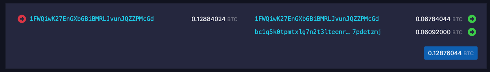

The address ```1FWQiwK27EnGXb6BiBMRLJvunJQZZPMcGd``` uses a UTXO of 0.12884024 that is transformed into a payment amount of 0.06092000 and change of 0.06784044 back to the sender's address. In this transformation, a network fee is also deducted.

Another common form of transaction aggregates multiple inputs (3 in the example) into a single output. This represents the real-world equivalent of exchanging a pile of coins and banknotes for a single higher-value note. Or rather, burning those old notes and creating a single new one that represents the value of all of them.

Transactions like these are sometimes generated by wallet applications to clear many small values received as change, a process called transaction consolidation. Usually, a consolidation transaction is done when network fees are low.

Basically, you create a transaction to your own address, whose value is the sum of all your smaller UTXOs. And voila, the value is consolidated into a single higher-value UTXO. Consolidating UTXOs during low-fee periods helps save on fees in future transactions with other people. Later, we will understand better why consolidating UTXOs during low-fee periods is an important practice.

In this type of transaction, multiple inputs are collected. A single output is created.

A real example of this type of transaction:

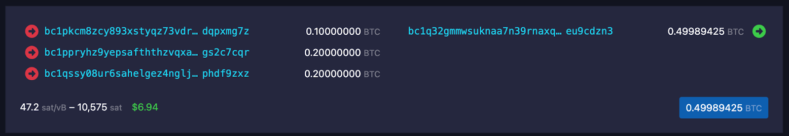

Another form of transaction frequently observed in the Bitcoin ledger distributes one input to multiple outputs, which may or may not represent multiple independent recipients. This type of transaction is sometimes used by commercial entities, such as when processing employee payroll. From a single input, multiple outputs are credited to the new owners' Bitcoin addresses.

A real example of this type of transaction:

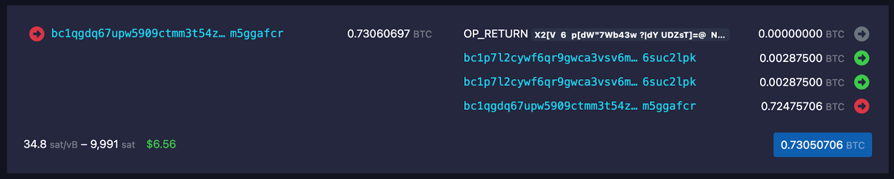

The OP_RETURN field in Bitcoin transactions is used to embed arbitrary data in the blockchain. This field allows the inclusion of information without affecting the spendability of bitcoins. There are services that pass documents through SHA-256 and record the resulting hash in this field, to permanently register the authenticity of a document that can be verified later. This practice is not widely accepted in the Bitcoin community, but it is one way the Bitcoin network is used.

Another type of transaction frequently observed in the Bitcoin ledger is the coinbase transaction. Unlike regular transactions, the coinbase transaction has no input because it represents newly generated coins. It has only one output, which is credited to the Bitcoin address of the block's miner.

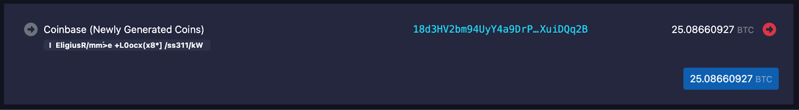

**First Bitcoin Transaction**
Below is the first Bitcoin transaction ever made, between Satoshi Nakamoto and Hal Finney. In this transaction, Satoshi sent 10 BTC to Hal Finney, with 40 BTC returning as change. We can also see the coinbase transaction of the block in which this transaction was included, which has no inputs and includes a block reward of 50 BTC.

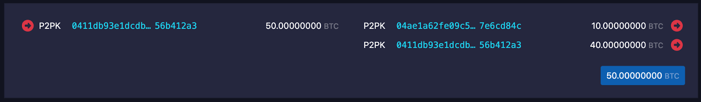

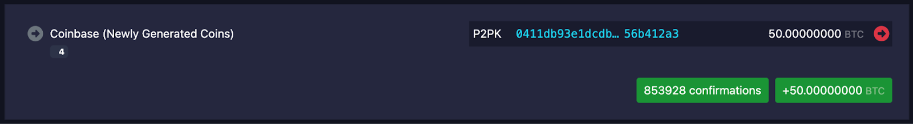

## 3.2 SegWit—Segregated Witness and Transaction Malleability

Transaction malleability is a vulnerability that would allow a malicious actor to modify ("malleate") a transaction by altering the witness data in a way that changes the transaction ID. (Remember that after confirmation, the digital signature and thus the transaction ID are immutable.)

What is produced now is a second transaction that signs the same amount to the same destination address but with an altered transaction ID. This attack does not allow the attacker to steal funds or change the destination of the funds. However, it can be used to defraud the sender by tricking them into sending a second payment after the original transaction appears to have not been confirmed.

**Transaction Malleability**

[Transaction Malleability Explained](https://www.mycryptopedia.com/transaction-malleability-explained/)

Fact: Mt.Gox, the largest exchange in Japan, collapsed in February 2014, suspended all withdrawals, and blamed transaction malleability for the suspension of withdrawals.

**SegWit arose to solve the transaction malleability problem.**

Segregated Witness (SegWit) is an architectural change activated on Bitcoin on August 1, 2017. It moves the witness data of transactions from the scriptSig (unlocking script) field of a transaction to a separate witness data structure that accompanies the transaction.

Most of the space in a transaction (about 65% or more) can be occupied by signature data. By moving the witness data out of the transaction, the transaction hash used as an identifier no longer includes the witness data.

SegWit facilitates and makes it safer to implement payment channels, the Lightning Network, and other more advanced scripting capabilities that will be introduced in the future.

[SegWit Explained](https://cointelegraph.com/explained/segwit-explained)

**Brief History**
- December 7, 2015: Pieter Wuille first presented the idea of Segregated Witness at the Scaling Bitcoin workshops in Hong Kong as a solution to Bitcoin's scalability problems.
- August 23, 2017: Segregated Witness was fully activated as a soft fork on the Bitcoin network.

**Benefits**
SegWit increases the block capacity from 1MB to a theoretical and maximally efficient 4MB, allowing more transactions to fit in each block and reducing transaction fees.

Nodes can prune the witness data after validating the signatures or ignore it entirely when performing simplified payment verification. It prevents transaction malleability attacks, enables more complex scripts, and maintains backward compatibility, being a soft fork.

**Adoption of Segregated Witness since its activation in 2017**
Most wallets and exchanges now support SegWit. Bitcoin Core versions since 0.16.0 include full support for SegWit. The percentage of Bitcoin transactions using SegWit exceeded 50% in September 2019 and surpassed 75% in August 2021.

**Why hasn't SegWit been fully adopted?**
- Since it was not a mandatory update, wallets and exchanges adopt it at their own pace.
- Users had to familiarize themselves with new address formats (wrapped and native SegWit).
- Misconceptions about how SegWit worked led to its scalability and fee benefits being overlooked.

## 3.3 MultiSig: Multi-Signature Transactions in Bitcoin

Bitcoin has multi-signature functionality (abbreviated as 'multisig'), in which the movement of funds can be configured to require more than one signature—a quorum of signatures to authorize transactions, thus increasing security.

**Corporate Use:** MultiSig wallets can be useful in a corporate environment where multiple people need to approve the movement of funds. They can also be used to facilitate custodial services, especially in larger transactions with unknown entities.

**Individual Setup:** A single individual can create a MultiSig setup where they own all the keys, storing each of the keys on different devices (e.g., mobile phone, laptop, and hardware wallet), with the requirement that signatures from two of the three keys authorize a transaction.

**Protection Against Attacks:** MultiSig setups can help protect users against phishing attacks and malware infections. Even if one of the mentioned devices is lost, stolen, or compromised, a single key will not be sufficient to access the funds; the original owner can still access their funds using the remaining two keys.

This functionality is crucial to improve the security and reliability of Bitcoin transactions, providing an additional layer of protection and control over funds.

The most common condition for multi-signature transactions is to use an M-of-N scheme. In a 2-of-3 scheme, three public keys are listed as potential signers, and at least two of them must be used to create signatures for a valid transaction and spend the funds.

[MuSig](https://medium.com/blockstream/musig2-simple-two-round-schnorr-multisignatures-bf9582e99295): A new multi-signature scheme based on Schnorr that is under development is designed to make Bitcoin multi-signature transactions less complex without sacrificing privacy.

Due to MuSig's innovative key aggregation feature, this signature is a regular Schnorr signature that can be processed by Bitcoin since the activation of Taproot. When used to create multisig wallets, MuSig reduces transaction fees and increases privacy compared to the traditional way of using the CHECKMULTISIG opcode for n-of-n signatures, which requires n public keys and n ECDSA signatures on the blockchain.—Jonas Nick, Tim Ruffing

**Taproot**, activated on the Bitcoin network in November 2021, allows for more complex transactions and scripts, including those utilizing Schnorr and MuSig signatures. Taproot improves privacy by making multisig transactions indistinguishable from regular transactions.

The BIP that defines Taproot is BIP 341. This Bitcoin Improvement Proposal introduces 

**Pay-to-Taproot (P2TR)**, which combines the functionality of Pay-to-PubKey (P2PK) and 
**Pay-to-Script-Hash (P2SH)**, offering users greater flexibility and privacy benefits.

In addition to BIP 341, Taproot also includes:
- BIP 340: Implements Schnorr signature technology, which is more secure and flexible, allowing for key aggregation.
- BIP 342: Updates the Bitcoin script language (Tapscript) to accommodate Schnorr signatures and Taproot technology.

## 3.4 Bitcoin Script

Bitcoin Script is a **stack-based language**, in **reverse Polish notation**, and **Turing-incomplete**, used in the Bitcoin protocol for transaction scripts. It is an **interpreted language, not compiled**. It is specifically designed to process and validate Bitcoin transactions.

Bitcoin Script is different from traditional programming languages that require a compiler for several reasons. It is not a compiled language but an interpreted one, designed for processing specific, secure, and deterministic transactions within the Bitcoin network.

Bitcoin nodes interpret the script at the time of transaction verification. The language is intentionally limited in complexity to avoid security risks and ensure that transaction verification remains fast and deterministic.

By being Turing-incomplete, Bitcoin Script avoids loops and more complex control structures that could lead to infinite loops or other computational risks, increasing security and predictability.

It is specifically designed to define the conditions under which a Bitcoin transaction can occur rather than for general-purpose computation. If the final output of the interpretation is True, the transaction happens. If False, the transaction is rejected and does not occur.

Bitcoin Script operates using a stack-based execution model, where operations are pushed and popped during script execution, similar to the Assembly language. The deterministic nature of stack-based operations ensures consistent transaction validation results across all Bitcoin nodes.

The language includes a set of basic commands [OPCODES](https://en.bitcoin.it/wiki/Script) for handling cryptographic functions, conditionals, and other simple operations necessary for transaction scripts. The absence of complex constructs like functions or classes reflects its specialized role in the Bitcoin ecosystem.

**Examples of Bitcoin Script usage include:**
- **P2PKH (Pay-to-PubKey-Hash):** A standard transaction script type that locks Bitcoin to a specific public key hash.
- **P2SH (Pay-to-Script-Hash):** Allows more complex scripts to be executed at spending time, facilitating multi-signature transactions and other advanced features.

**Locking Script: ScriptPubKey**
ScriptPubKey is a script included in the output of a Bitcoin transaction. It specifies the conditions that must be met for that output (UTXO) to be spent in a future transaction. Basically, it defines 'who' or 'what' can spend this UTXO.

- **Opcode:** Scripts in Bitcoin are composed of a series of opcodes, which are instructions that the Bitcoin virtual machine (Bitcoin Script) executes.
- **Public Key or Public Key Hash:** The ScriptPubKey typically contains the recipient's public key or public key hash.

One of the most common ScriptPubKey formats is P2PKH (Pay-to-PubKey-Hash). Let's look at an example to understand it better.

**Example of P2PKH**

When Alice sends Bitcoin to Bob, the transaction creates an output that includes a ScriptPubKey like this:

```OP_DUP OP_HASH160 <Bob's Public Key Hash> OP_EQUALVERIFY OP_CHECKSIG```

**OP_DUP**: Duplicates the public key that will be provided in the spending transaction (i.e., creates a copy of the item on top of the execution stack).  

**OP_HASH160**: Performs a RIPEMD-160 hash followed by a SHA-256 hash on the duplicated public key.  

**<Bob's Public Key Hash>**: This is Bob's public key hash, provided by Alice when creating the transaction.  

**OP_EQUALVERIFY**: Compares the two values on top of the stack (the calculated hash of the public key provided in the spending transaction and Bob's public key hash). If they are equal, verification continues; otherwise, the transaction fails.  

**OP_CHECKSIG**: Verifies that the signature provided in the spending transaction is valid for the provided public key.  

**Conditions to Spend the UTXO**

To spend the UTXO protected by this ScriptPubKey, Bob needs to create an input transaction that provides:  
- **Public Key:** This public key will be used in the verification script (ScriptSig) of the input transaction.  
- **Valid Signature:** This signature must match the public key and the transaction, proving that Bob possesses the private key corresponding to the specified public key.  

-**Unlocking Script—ScriptSig** Provides the necessary data to satisfy the conditions of the ScriptPubKey. If the result of the operation is True, the value is released.

```<Bob's Signature> <Bob's Public Key>```

When this spending transaction is executed, the script combines the ScriptSig with the ScriptPubKey as follows:
1. Bob's public key is duplicated (OP_DUP) and then hashed (OP_HASH160).
2. The resulting hash is compared to the public key hash stored in the UTXO (OP_EQUALVERIFY).
3. If the hash is equal, Bob's signature is verified against the public key and the transaction (OP_CHECKSIG).
4. If all these conditions are met, the UTXO is considered spent, and the transaction is validated.

The ScriptPubKey defines the conditions under which a UTXO can be spent, ensuring that only the holder of the private key corresponding to the specified public key (or public key hash) can spend the funds. This is fundamental to the security and integrity of Bitcoin transactions.

**MultiSig Signature**

The general form of an M-of-N multi-signature transaction script is as follows:

```M <Public Key 1> <Public Key 2> ... <Public Key N> N OP_CHECKMULTISIG```

In the case of a 2-of-3 multi-signature transaction, the locking script is as follows:

```2 <Public Key A> <Public Key B> <Public Key C> 3 OP_CHECKMULTISIG```

- **2** means that 2 signatures are required.  
- **<Public Key A> <Public Key B> <Public Key C>** are the 3 public keys involved.  
- **3** indicates that there are 3 public keys in total.  
- **OP_CHECKMULTISIG** is the opcode that verifies multiple signatures.

**Unlocking Script**

The script above forms a "locking script," which can only be unlocked by an equivalent "unlocking script" containing 2 or more signatures calculated from the private keys of the signers, corresponding to the listed public keys:

```OP_0 <Signature B> <Signature C>```

- **OP_0** is necessary due to a historical bug in Bitcoin that requires an additional zero for the MultiSig script.  

- **<Signature B> <Signature C>** are two valid signatures corresponding to two of the public keys mentioned in the Locking Script.

**Validation Script**

When a transaction is verified, the Unlocking Script and the Locking Script are combined to form the Validation Script:

```OP_0 <Signature B> <Signature C> 2 <Public Key A> <Public Key B> <Public Key C> 3 OP_CHECKMULTISIG```

This configuration allows a multi-signature transaction to be correctly validated, ensuring that the required signatures correspond to the public keys listed in the script.

Learn more about transactions by reading the article [Bitcoin P2PKH Transaction Breakdown](https://medium.com/coinmonks/bitcoin-p2pkh-transaction-breakdown-bb663034d6df) by Rachel Rybarczyk—Board Member of Scalar School.

### 3.5 Miniscript
Miniscript is a language developed to write Bitcoin scripts in a structured way, allowing for analysis, composition, generic signing, and more. It was designed and implemented by Pieter Wuille, Andrew Poelstra, and Sanket Kanjalkar at Blockstream Research. The goal of Miniscript is to facilitate the creation of complex spending conditions and ensure the security, efficiency, and interoperability of Bitcoin scripts.

Miniscript offers a structured representation of Bitcoin scripts, allowing software to automatically analyze the script and determine which witness data needs to be generated to spend the bitcoins protected by that script.

The Bitcoin scripting language allows scripts to be composed of smaller, valid expressions, making it easier to create complex spending conditions. This is especially useful for wallet developers, who don't need to rewrite code when switching from one script model to another.

Miniscript optimizes transaction compilation, which can result in a smaller footprint on the blockchain, saving transaction fees. Additionally, the structure of Miniscript facilitates the creation of more complex and secure smart contracts directly on the Bitcoin base chain.

**Decreasing Multisig:** Allows the creation of multisig wallets where the number of required signatures can decrease over time or after a specific period, providing additional flexibility in cases like key loss. 

**Inheritance and Timelocks:** Facilitates the creation of inheritance wallets where funds can be accessed by heirs after a specific period, functioning as a kind of automated inheritance switch.  

Bitcoin Script is a stack-based language with many special cases, designed to implement spending conditions consisting of various combinations of signatures, hash locks, and time locks. However, working directly with Bitcoin Script can be difficult and error-prone, especially for complex spending conditions. Miniscript addresses these issues by providing a more structured and easier-to-understand way to compile Bitcoin scripts.

Miniscript promises to facilitate the development of more secure and efficient Bitcoin scripts, improving usability and security for developers and end-users. While adoption may take some time, its advantages in terms of security, flexibility, and efficiency make it a valuable tool for the future of Bitcoin transaction development.

To learn more about Bitcoin Miniscript, visit [bitcoinops.org](https://bitcoinops.org/en/topics/miniscript/).

### 3.6 CoinJoin

CoinJoin is a Bitcoin transaction where multiple users combine their UTXOs, improving privacy. It is one of the essential tools for preserving human rights in the context of using Bitcoin. It allows transactions to be mixed in a way that enhances user privacy, making it more difficult to trace the origin and destination of funds. In a world of increasing financial surveillance, protecting transaction privacy is crucial to ensuring the freedom and safety of activists, journalists, and ordinary citizens living under oppressive regimes.

[Greg Maxwell](https://bitcointalk.org/?topic=279249) wrote on the Bitcointalk forum in 2013: "Bitcoin is often promoted as a privacy tool, but the only privacy that exists in Bitcoin comes from pseudonymous addresses, which are fragile and easily compromised through reuse, taint analysis, payment tracking, IP address node monitoring, web-spidering, and many other mechanisms. Once broken, that privacy is difficult and sometimes costly to recover..."

Adopting CoinJoin from the start of your Bitcoin journey is vital. This not only protects individual privacy but also strengthens the network as a whole, making it harder for malicious entities to track transactions and identify users. Financial privacy is a pillar of freedom and autonomy, and its widespread use can be a powerful tool to preserve a future where human rights are respected and protected.

**Transaction Combination:** CoinJoin is a method where multiple users combine their transactions into a single Bitcoin transaction. This means that multiple inputs and outputs from different users are combined into a single block.  

**Anonymity through Mixing (Coin Mixing):** By combining transactions from multiple users, it becomes difficult to determine which output belongs to which original input. This increases privacy, as external observers cannot easily trace the origin and destination of funds.

**Process Steps**

- **Coordination:** A CoinJoin coordinator or server gathers transaction intentions from multiple participants.
- **Partial Signatures:** Each participant creates and partially signs their parts of the transaction.
- **Combination:** The coordinator combines all parts into a single complete transaction.
- **Final Signature:** Each participant signs the complete transaction.
- **Broadcast:** The finalized transaction is sent to the Bitcoin network.

**CoinJoin Tools**
- [Wasabi Wallet](https://github.com/WalletWasabi/WalletWasabi)
- [Sparrow Wallet](https://sparrowwallet.com/)
- [JoinMarket](https://github.com/JoinMarket-Org/joinmarket-clientserver)
- [Jam](https://github.com/joinmarket-webui/jam) A UI interface for the JoinMarket software.

### 3.7 Block Explorers
A block explorer is an indispensable tool for viewing and interacting with the Bitcoin network. It allows you to access a wide range of detailed information about transactions, blocks, and addresses. Here's a snapshot of the block explorer [mempool.space](https://mempool.space/).

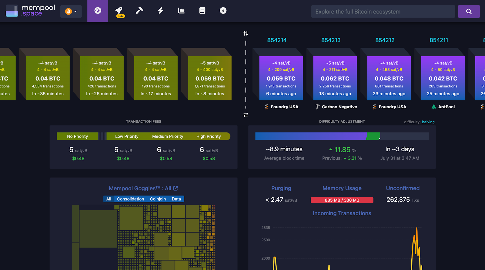

#### Transaction Information
With a block explorer, you can query transaction details such as inputs, outputs, network fees, and change. This makes it easy to observe how each transaction is connected to previous transactions, promoting transparency and traceability.

You can check the number of confirmations a transaction has, indicating its security and immutability, as well as the time it was included in a specific block.

Additionally, you can view the locking scripts (ScriptPubKey) and unlocking scripts (ScriptSig) of transactions and obtain detailed information about each input and output, including the addresses involved and the amounts transferred.

#### Mined Blocks
Mined blocks have detailed information such as the responsible miner, block size, the number of transactions included, and the total block reward, which includes the base reward and the transaction fees collected.

You can view the current balance of a specific address and its complete transaction history, offering a clear view of fund movements.

#### Network Statistics
Block explorers also provide access to network statistics. You can see the current hash rate, indicating the total computational power used to mine blocks, and the mining difficulty, which adjusts periodically to keep the block time constant.

#### Additional Features
Some block explorers offer additional features such as alerts and notifications. You can set up alerts to be notified when a specific transaction is confirmed or when an address sends or receives funds. This helps monitor relevant activities on the blockchain in real-time.

#### APIs for Developers
Block explorers can also offer data APIs, allowing developers to programmatically access blockchain information to integrate into their applications. This is essential for developing tools and services that interact directly with the Bitcoin blockchain.

#### Privacy and Security with Your Own Node
When you access a block explorer in your browser, it makes a request to a Bitcoin network node to obtain specific data. The node processes the request, extracts relevant data from the blockchain, and sends it back to the explorer, which then presents this information in a user-friendly and accessible way. Generally, these nodes are operated by third parties such as companies or organizations. While convenient, there are risks associated with trusting these nodes, such as privacy issues, data reliability, censorship, and security.

To mitigate these risks, it is possible to install a block explorer on your own Bitcoin node. This offers full control over the data queried, avoiding third parties monitoring your activities and ensuring you are accessing information directly from a trusted node.

#### Information Available on Block Explorers
- **Hash Rate:** Indicates the total computational power being used to mine blocks.
- **Mining Difficulty:** Adjusted periodically to maintain constant block time.
- **Total Number of Nodes:** Displays the number of active nodes on the Bitcoin network.
- **Block Height:** The number of the most recent block in the blockchain.
- **Transaction Volume:** Total number of confirmed transactions over a specific period.
- **Blockchain Size:** The total size of the blockchain in gigabytes.
- **Transaction Confirmations:** The number of confirmations a transaction has received, indicating its security and immutability.
- **Transaction Time:** The timestamp when the transaction was included in a block.
- **Locking and Unlocking Script:** View the locking scripts (ScriptPubKey) and unlocking scripts (ScriptSig) of transactions.
- **Input and Output Details:** Detailed information about each input and output, including the addresses involved and the amounts transferred.
- **Transaction Fee:** The fee paid to include the transaction in the block.
- **Transaction Size:** The total size of the transaction in bytes.
- **Mempool:** Pending transactions that have not yet been confirmed and included in a block.
- **Miner:** The identification of the miner who mined the block (when available).
- **Block Size:** The total size of the block in bytes.
- **Number of Transactions:** The number of transactions included in the block.
- **Block Reward:** The total reward received by the miner, including the base reward and the transaction fees.
- **Mining Time:** The time it took to mine the block.
- **Nonce:** The value miners adjust to find a valid hash for the block.
- **Block Version:** The block's version number.
- **Current Address Balance:** The total balance of a specific address.
- **Transaction History:** All transactions involving the address, including received and sent amounts.
- **Unconfirmed Balance:** The balance of transactions that have not yet been confirmed.
- **First and Last Transaction:** Dates of the first and last transactions associated with the address.
- **Average Transaction Fees:** Average transaction fees paid over a specific period.
- **Fee Estimates:** Recommended fee estimates for transactions to be confirmed within a certain number of blocks.
- **Fees Paid per Block:** The total transaction fees paid in each block.

Block explorers are versatile tools that provide a wide range of information and functionalities, from basic transaction details to advanced analytics and API integrations. They are essential for users who want to understand the workings of the Bitcoin blockchain better, monitor their transactions, and develop applications that interact with the network.

You can use any block explorer to search the entire blockchain, as all transactions are publicly visible. To get started, see a list of them at [bit.ly/blockexplorers](http://bit.ly/blockexplorers). The most used are mempool.space and blockstream.info. Choose any transaction, follow it, and see what you can discover about the inputs, outputs, network fees, and change. Observe how it is connected to previous transactions.

You can search for the ID of the first Bitcoin transaction, which is essentially the first txid ever created on the network.

**First Bitcoin transaction:** Satoshi Nakamoto sent 10 BTC to Hal Finney

```f4184fc596403b9d638783cf57adfe4c75c605f6356fbc91338530e9831e9e16```

#### Blockchain Data Structure
The interactive blockchain tool on Anders Brownworth's website is an educational resource designed to help users understand the fundamental concepts of blockchain technology. It simulates how a blockchain works, allowing you to explore and visualize the processes of block creation, hashing, block chaining, and how transactions are securely and immutably recorded.  

[Anders Brownworth's Blockchain Tool](https://andersbrownworth.com/blockchain/blockchain)

### 3.8 Transaction Fees
Transaction fees are small amounts of Bitcoin that users pay to have their transactions processed and confirmed by miners. These fees serve as an incentive for miners to include the transaction in the next block they mine.

Another important feature of block explorers is the analysis of transaction fees. You can look up the average fees paid over a specific period and get recommended fee estimates to have transactions confirmed quickly. This is particularly useful for users who want to optimize the cost of their transactions.

The fee is not fixed and can vary based on several factors:

- **Transaction Size:** Larger transactions (in terms of data size, not the amount of Bitcoin) require more space in a block, which can increase the fee. Using multiple small UTXOs has a higher cost than a single UTXO of equivalent value.

- **Network Congestion:** When the network is busy, fees tend to rise as users compete to have their transactions confirmed quickly.

- **User Priority:** Users can choose to pay higher fees to speed up their transactions. Higher fees generally result in faster confirmations.

Transaction fees are usually calculated per byte of data in the transaction. Wallet software often suggests an appropriate fee based on current network conditions, ensuring that the transaction is confirmed within a reasonable time. Users can set their fees manually, but setting a fee too low can result in delayed confirmations.

When you send Bitcoin over the network, the wallet software allows you to enter the fee amount you want to pay. Knowing the average fee at the time of the transaction and choosing a value slightly above it increases the likelihood that your transaction will be confirmed in the desired time.

#### Virtual Bytes (vbytes)

Virtual bytes (vbytes) are a unit of measure used to calculate transaction fees in Bitcoin more efficiently and fairly, especially after the activation of Segregated Witness (SegWit). They help better reflect the actual impact of a transaction on the blockchain.

SegWit was an upgrade to the Bitcoin protocol that, among other things, separated the signature (witness) from the transaction data. This update allowed for better utilization of block space, increasing transaction capacity without changing the maximum block size of 1 MB.

Before SegWit, transaction fees were based on the total transaction size in bytes. After SegWit, transactions have two parts: regular data and witness data. Witness data is less critical for network propagation and validation, so a new way to measure the impact of transactions was needed.

**Definition and Calculation of vbytes**

A vbyte is a unit of measure that adjusts the actual size of a transaction, considering the differentiated weight of witness data. The basic formula to calculate vbytes is:

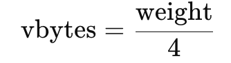

Where weight is a metric that combines the size of regular data and witness data.

**Weight Units (WU)**

- Each byte of regular transaction data counts as 4 weight units.
- Each byte of witness data counts as 1 weight unit.

For example, if a transaction has:
- 100 bytes of regular data: 100 × 4 = 400 weight units
- 200 bytes of witness data: 200 × 1 = 200 weight units

Total weight: 400 + 200 = 600 weight units

Then, the vbytes would be calculated as:

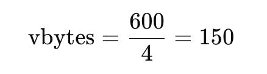

Using vbytes in the calculation of transaction fees allows for a better correlation between the fee paid and the actual use of block space, promoting a more efficient allocation of network resources. SegWit transactions tend to be more compact in terms of vbytes, resulting in lower fees. This incentivizes users to adopt SegWit, increasing the network's effective capacity.

#### Replace-by-Fee (RBF)
Replace-by-Fee (RBF) is a feature in the Bitcoin protocol that allows the sender of a transaction to replace a pending (unconfirmed) transaction with a new transaction that has a higher transaction fee. The main purpose of RBF is to increase the likelihood of transaction confirmation during network congestion. Many wallet software applications have this feature built-in.

Bitcoin Value: To know its equivalent value in your local currency, you can search for "Bitcoin price" on Google or use currency conversion tools. Google usually has an embedded conversion function when you search for the price, but there are other alternatives, such as [cointradermonitor.com](https://cointradermonitor.com/). It's always good to check more than one source.

**Historical Curiosity:** The Bitcoin network fee reached its peak value on the day of the 2024 halving, on April 19th. This indicates two things. First, when there are no more block subsidies available, miners can live off network fees. Second, layer 2 scalability solutions like the Lightning Network are extremely important to keep transaction fees low and the Bitcoin network efficient. I took a screenshot on my phone, as at that moment, I was in a Discrete Mathematics class at Fatec. 2832 sats/vB.

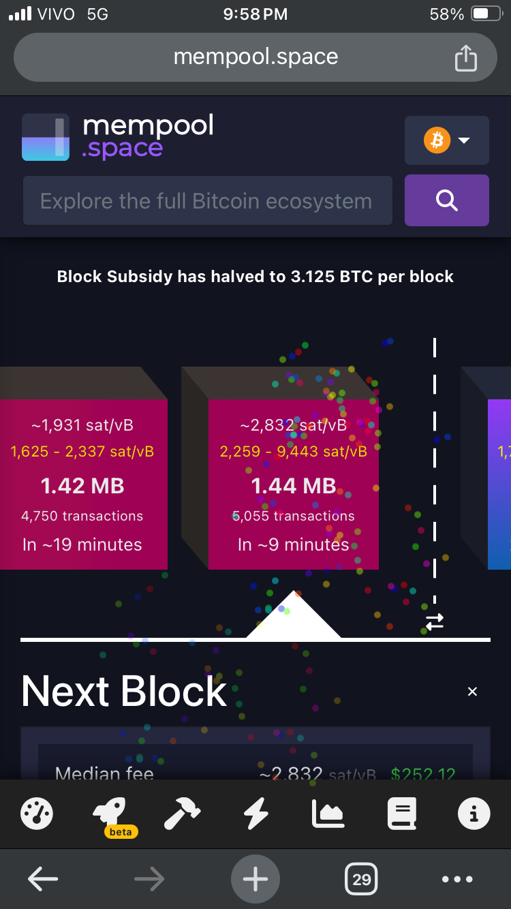

### 3.9 Practice: My First On-Chain Bitcoin
Let's experience a Bitcoin transaction in practice. Within a single Bitcoin wallet app, BlueWallet, you can create multiple wallets. So, I will test sending satoshis from one wallet to another that belongs to myself. The process for sending to another person's wallet is exactly the same. Let's start.

First, search for BlueWallet in the App Store or Play Store.
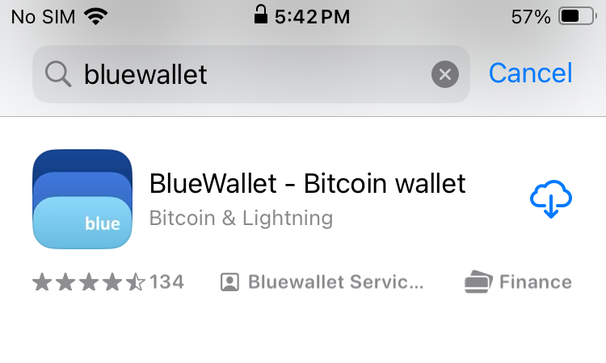

Now, in the access flow, you will have the option to create a wallet. Choose the first one, **Bitcoin—Simple and powerful Bitcoin wallet**.

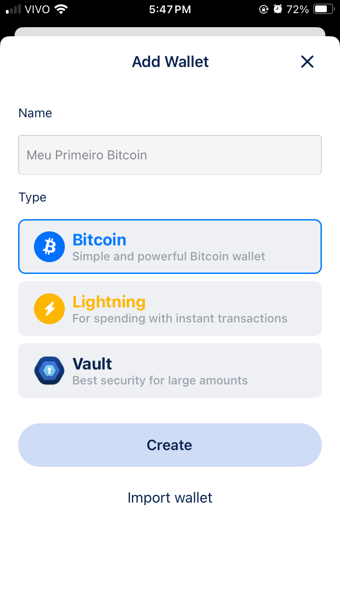

Write down your seed, preferably with a pencil as it doesn't wash away with water or alcohol. Do not take a screenshot!


After noting it down, **OK, I wrote it down** will take you to the main screen of your wallet.

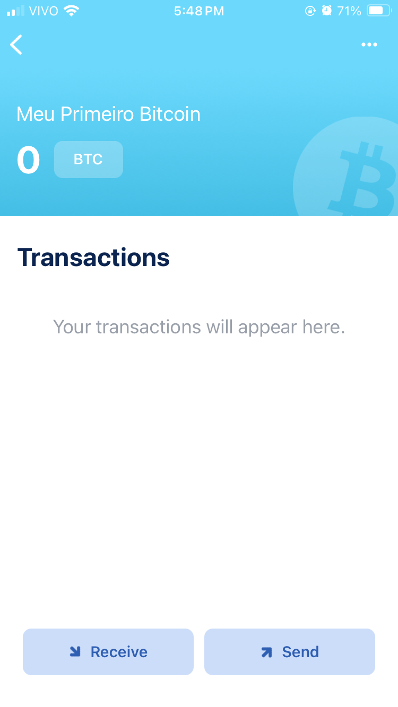

Since this wallet is empty, let's use it to receive some satoshis. Click on **Receive**. A receiving address will appear on the screen.


Clicking on this address will copy it to the clipboard, and I can share it with the person who will pay me, which in this case is myself. Now, let's go to another wallet that has some satoshis and try to send to this address. During the copy and paste process, be careful, double-check that all characters match exactly what was generated in the wallet, especially if it's between you and exchanges. There are malware programs out there that alter this address, and if you're not paying attention, you could be sending Bitcoin to a malicious actor.

Also, every time you acquire Bitcoin, make sure to transfer it to an adress generated by a wallet that is yours. 
Be careful with leaving Bitcoin in third-party platforms such as exchanges. It is not safe. 

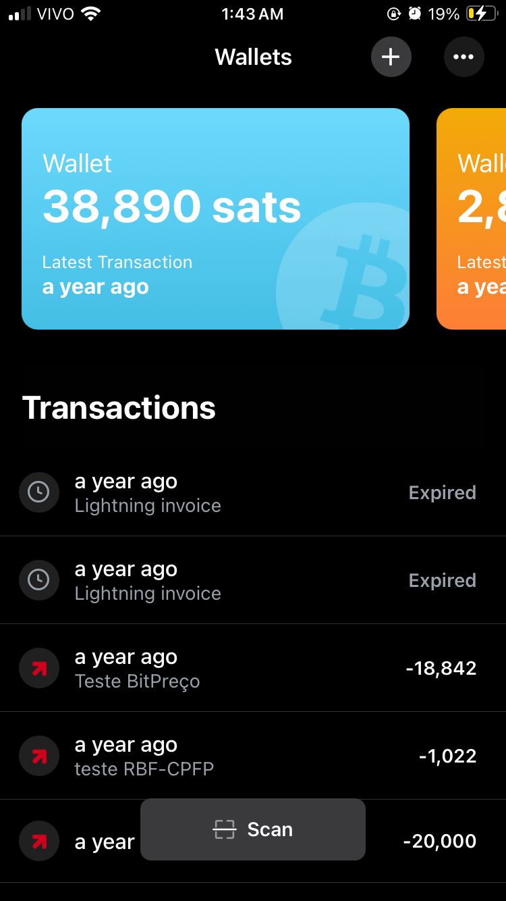

We enter the other wallet that has the funds and will send to this address of **My First Bitcoin wallet**.

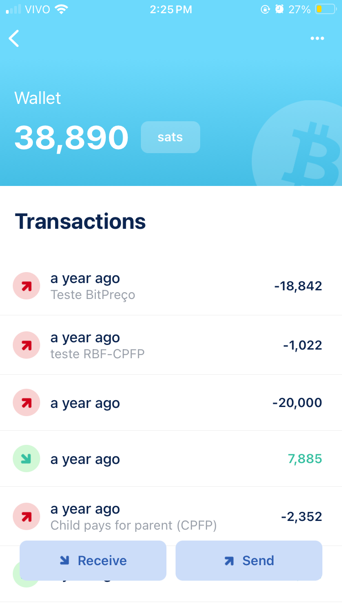

To do this, click on **Send**. Remember that the address to receive is already on the clipboard, so just paste it into the appropriate field.

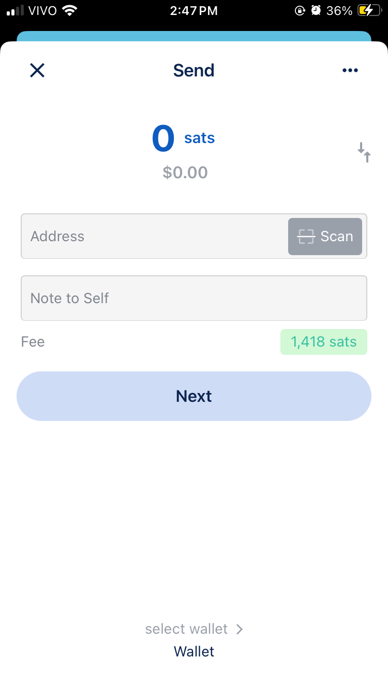

In the **Address** field, paste the address. In **Note to Self**, write an identifying comment for this transaction (these notes do not go to the blockchain; they are metadata at the wallet app level only). Where it shows the amount, enter the amount you want to send.

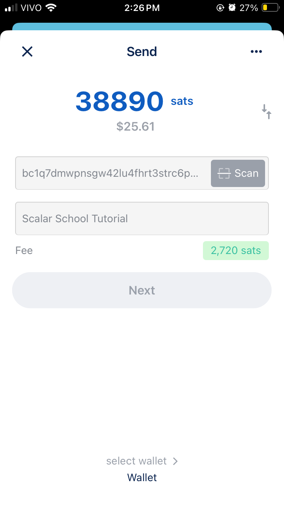

In my case, I wrote the total amount. But notice that the **Next** button remained inactive! This is because I didn't consider the network fee that I need to pay for the transaction to be processed, which is deducted from the wallet itself. Let's check the network fee environment. Access  and see what the average fee is for transactions to be included in blocks. 

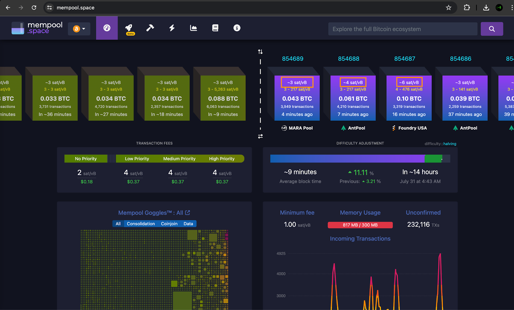

3 sats per virtual byte, 4 sats per virtual byte, 6 sats per virtual byte. Remember that each transaction has a set of data that needs to be recorded on the blockchain, and this data takes up disk space. The total value of a transaction depends on how much space we are demanding the network to process. If I make a payment of 38,000 sats using numerous small UTXOs to sum up the total value, it will be more expensive than making a payment of 38,000 sats with just one output UTXO.

That's why there's a process called **UTXO consolidation**, which is when a Bitcoiner takes advantage of low network fees to send the total value from one wallet to another, consolidating several smaller UTXOs into one large one that will be much cheaper to transact in the future. Returning to the wallet, let's click on that green fee-setting field.

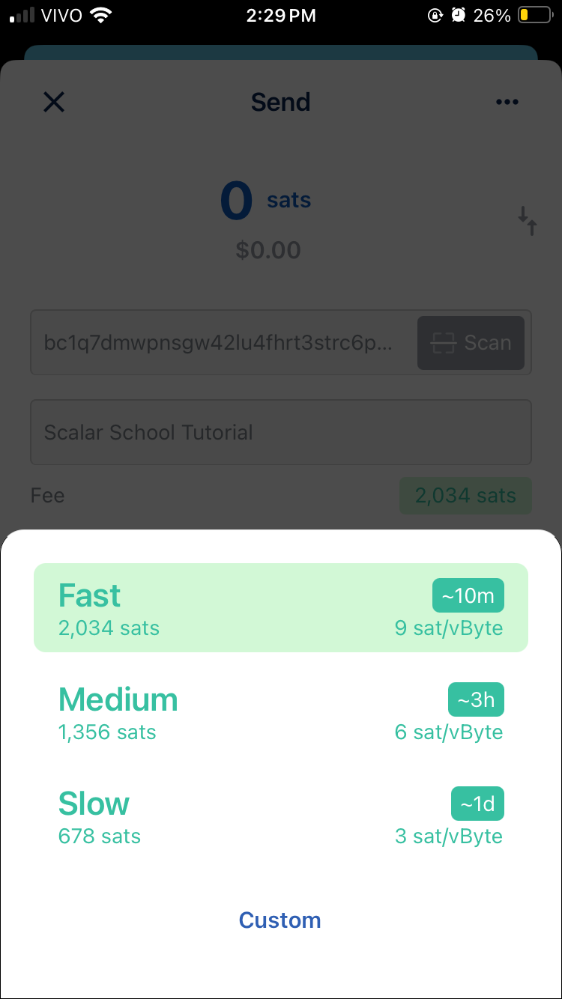

The app indicates that for our transaction to be confirmed (included in a block) quickly, we should pay around 9 sats/vByte. This is well above the value we checked on the block explorer, but that's okay, I'll accept the suggestion. Note that I kept lowering the value manually until the **Next** button became active, meaning until the fee value was covered.

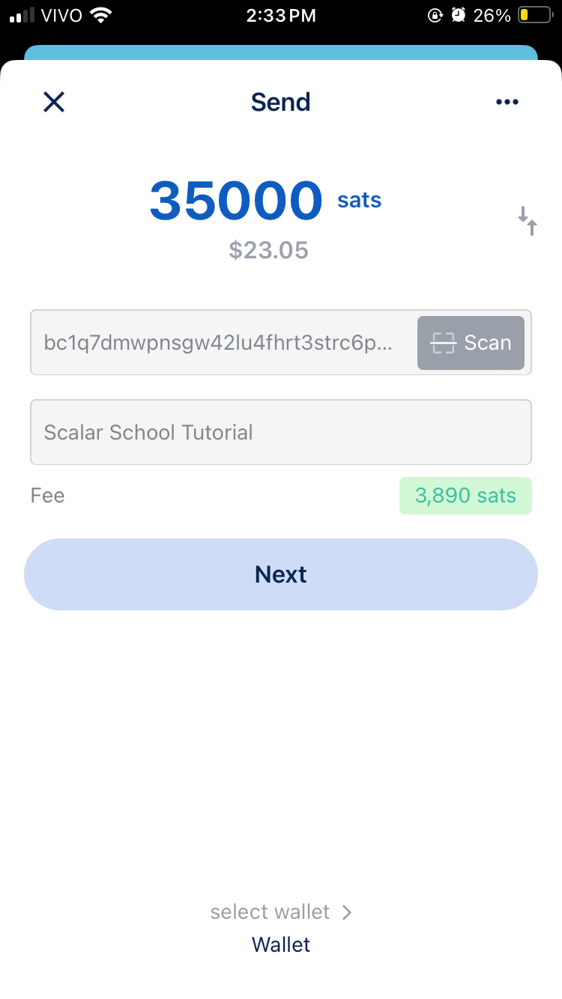

Clicking **Next**, we enter this screen. The app is showing the value in BTC, but you can always choose to view it in sats. Remembering that **1 Bitcoin = 100,000,000 Satoshis**.

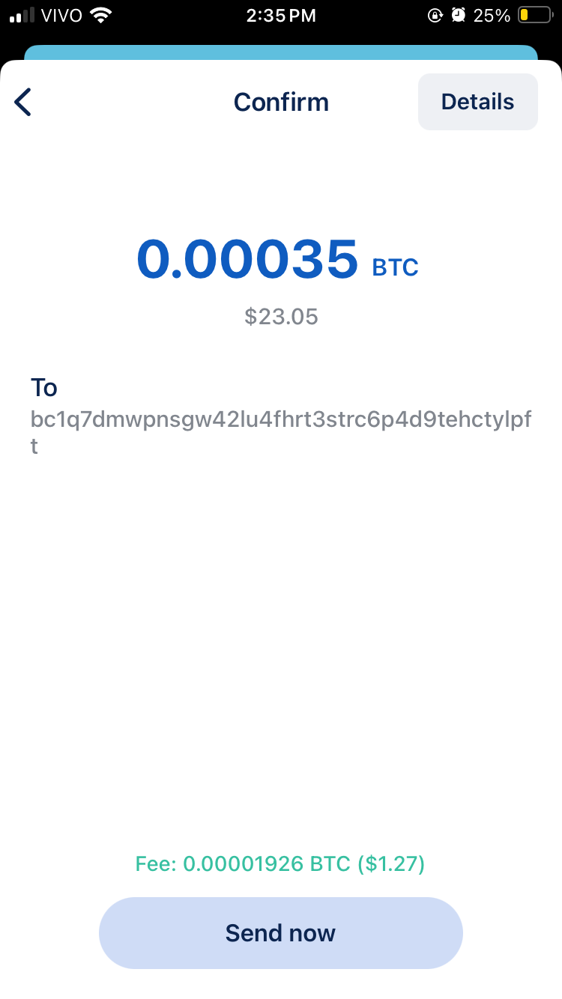

Clicking on **Details**, we can access more information about the structure of this transaction.

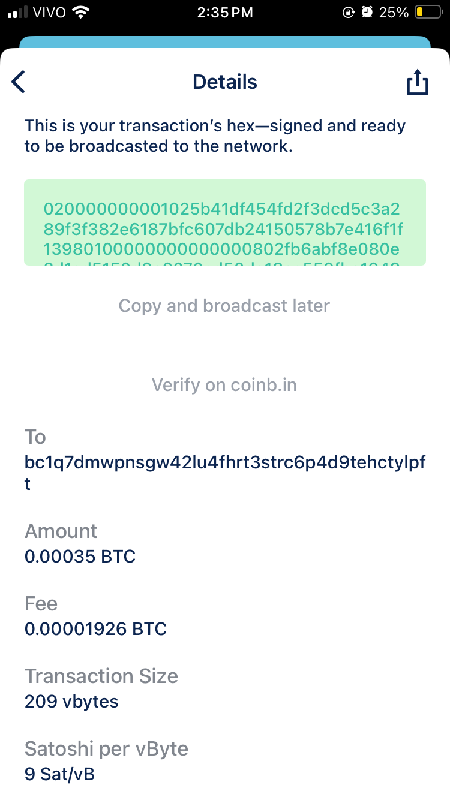

A transaction hexadecimal (hex) is a serialized representation of a Bitcoin transaction. It is essentially the raw transaction data encoded in hexadecimal format. This hex string contains all the necessary information about the transaction, including version number, inputs (previous transaction hash, index, scriptSig, sequence), outputs (value, scriptPubKey), locktime, and signatures, making it possible to broadcast it to the Bitcoin network.

You can decide to propagate the transaction through BlueWallet or copy this hex and propagate it later using other tools. Block explorers often have propagation tools, and you can also propagate through the command line of your Bitcoin Core node using the command ```sendrawtransaction```.

In this case, we return to the previous screen and click **Send now**.

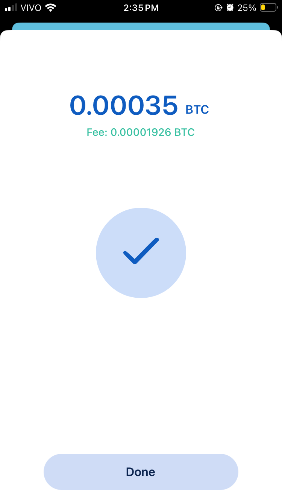

On the main screen, we see the transaction as **Pending**. It has been broadcast to the mempool but has not yet been included in a block.

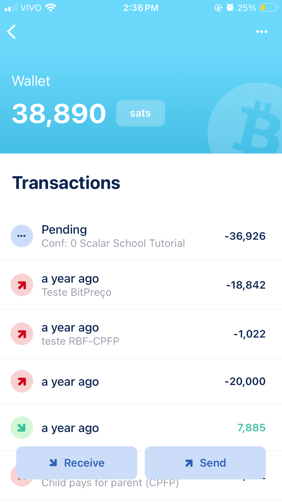

Clicking on it, we see the option to **Bump fee**, which is the RBF function. Let's suppose the network fee increased rapidly, and you want to update the value and add an extra fee to have your transaction keep up with the average. This is when you use **Bump fee**. There's also the option to cancel the transaction. But once it is confirmed or included in a block, it becomes irreversible.

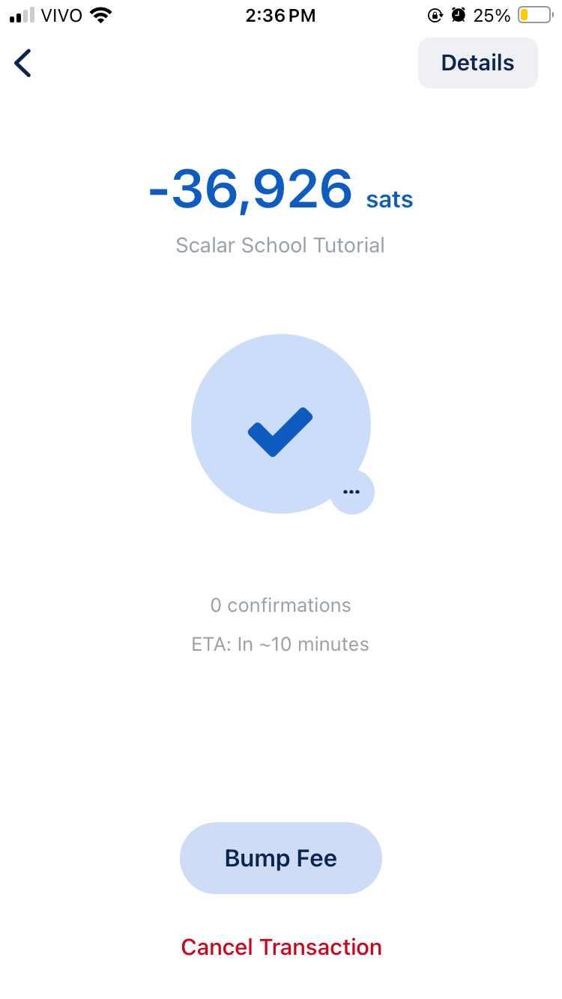

Clicking on details, we can access the transaction ID.

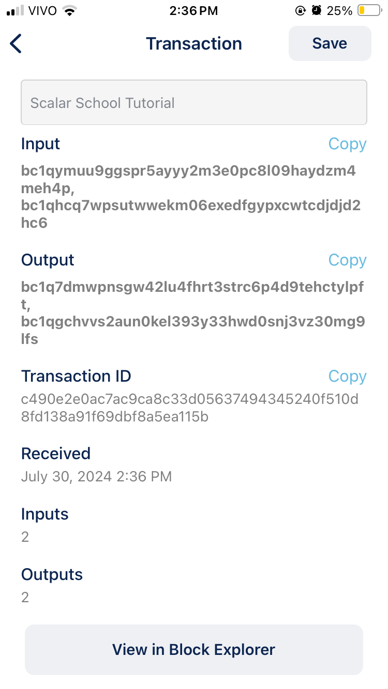

Copy this ID, and let's track our transaction until it is confirmed. You will paste this ID into the search field of a block explorer. In this case, I used mempool.space.

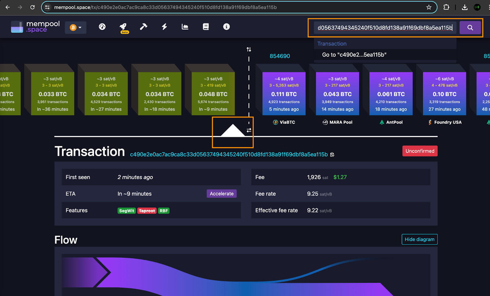

Notice that there's a white arrow pointing to the green area of blocks, which represents the mempool and a grouping of transactions by fee value—they are not yet actual blocks but transactions being considered for candidate blocks by miners. Only when this transaction is mined will it be included in a block in the purple part. 

The confirmation of this transaction happened almost in real-time. Also, we paid 3 times more than the fee that was really necessary. To be truly cautious in larger value trades, it is recommended to wait for 6 confirmations. This ensures that there can't be any possible block reorganizations that put your transaction back into the mempool.

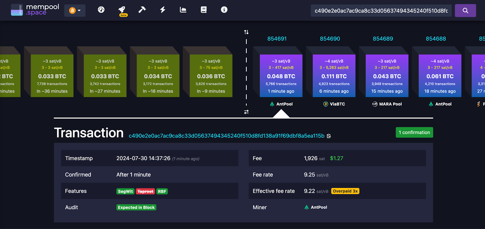

We can verify that the amount entered the new wallet. Hooray!

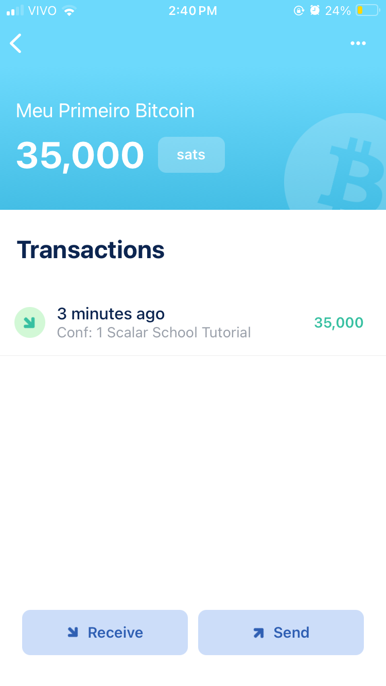


