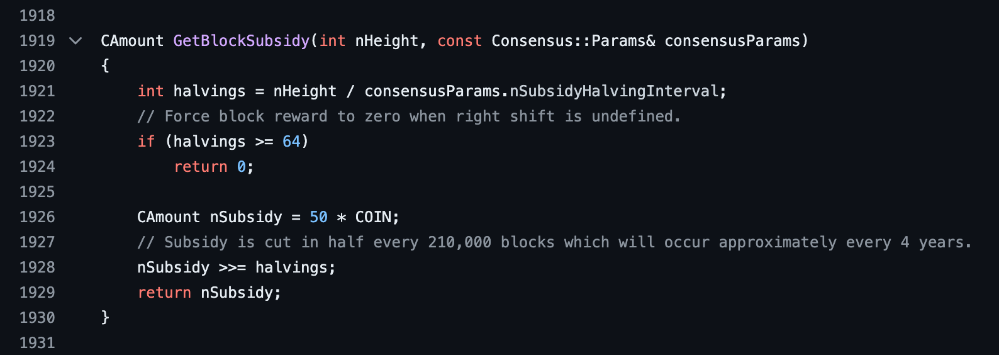
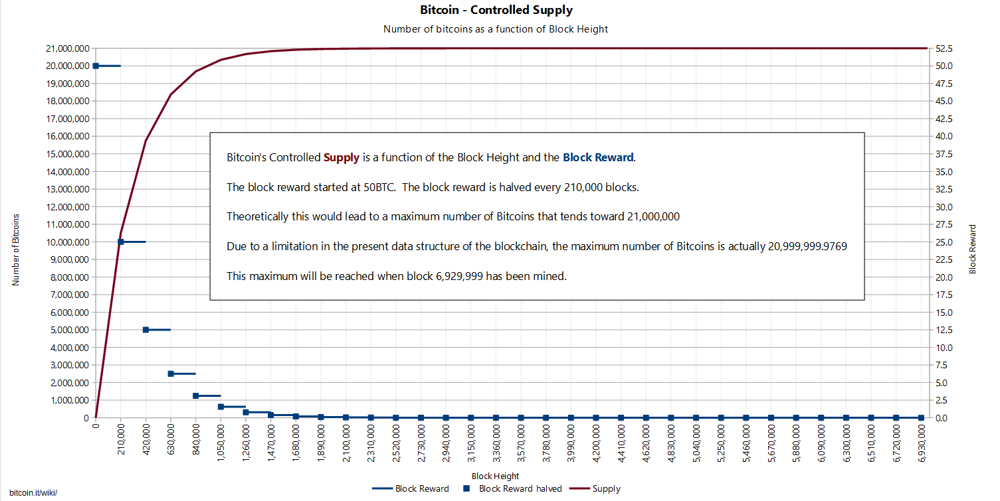

# 5. Mining 

## 5.1 Energy: Utilization and Infrastructure Development
Bitcoin mining can utilize surplus energy that would otherwise be wasted, such as energy generated from renewable sources during periods of low demand. This creates incentives for the development of electricity infrastructure in underdeveloped areas, as the presence of mining operations can make energy generation projects economically viable. Additionally, the constant demand for stable and cheap electricity for mining can stimulate investments in renewable energy technologies and energy efficiency, benefiting local communities and promoting more sustainable use of energy resources.

There are some notable electrical infrastructure projects in African countries that involve Bitcoin mining. Here are a few examples:

- **Gridless Compute**: Located in Kenya and other regions of East Africa, Gridless Compute uses hydroelectric microgrids to power Bitcoin mining operations in rural communities. This model leverages surplus energy that would otherwise be wasted, ensuring a constant and reliable demand for electricity, which in turn helps fund the expansion of electrical infrastructure in these areas. This project received funding from Jack Dorsey's Block and the venture capital firm Stillmark ([CoinDesk](https://www.coindesk.com), [Finbold](https://www.finbold.com)).

- **Virunga National Park**: Located in the Democratic Republic of the Congo, in Virunga National Park, Bitcoin mining is powered by hydroelectric plants, generating crucial income for the biological reserve and local communities. The heat generated by the mining equipment is also being used to dry cocoa beans, providing an economical and sustainable solution for local industrial processes ([Bitcoin Magazine](https://bitcoinmagazine.com)).

These projects demonstrate how Bitcoin mining can be integrated with renewable energy infrastructure initiatives to promote economic development and sustainability in underdeveloped regions.

## 5.2 Proof-of-Work

Mining is the process of adding new blocks to the blockchain and issuing new units of bitcoin. The integrity of transactions and blocks is guaranteed by the contribution of computational power, a process called proof-of-work (PoW). The data of the candidate block is hashed repeatedly until the hash value is smaller than a standard value determined by the current difficulty. A hash value is considered 'smaller' if it has more leading zeros than the number that determines the round's difficulty.

While it may seem complicated, don't worry, as the process is automated. Setting up and maintaining the mining machines is often the only manual work required. Mining machines are specially designed to perform hash calculations efficiently, using specialized hardware such as ASICs (Application-Specific Integrated Circuits).

Proof-of-Work (PoW) is a protocol that requires a significant computational effort to be performed but is easy to verify. In the context of Bitcoin, PoW is used to ensure that all participants agree on the current state of the blockchain.

In this process, miners compete to find a valid hash that meets the difficulty criterion. 

Bitcoin mining involves several continuous and cyclical steps performed by miners to add new blocks to the blockchain. Below, the process is logically detailed:

- **Collecting and Pooling Transactions from the Mempool**: Miners collect unconfirmed transactions from the mempool, which is a sort of 'waiting room' for transactions that have not yet been included in a block.

- **Organizing into a Candidate Block**: These transactions broadcast on the peer-to-peer network are organized into a candidate block. Miners can arbitrarily choose which transactions to include, usually opting for those with the highest fee per byte, generating greater profitability per mined block. They also verify that all transactions in the block are valid, ensuring there are no duplicates or invalid transactions.

- **Selecting the Previous Block**: The most recent block in the longest chain of the blockchain is selected, and its header hash is inserted into the new block.

This candidate block includes:

- **Hash of the Previous Block**: This hash points to the previous block in the blockchain, ensuring that blocks are linked in an immutable sequence, maintaining the timechain data structure (the original name for the blockchain).

- **Merkle Root**: A hash tree structure that represents all transactions in the block. The Merkle root is placed in the block header.

- **Timestamp**: A timestamp that records when the block was mined.

- **Nonce**: A number that miners change to find a valid hash that meets the network's conditions (i.e., starts with a certain number of zeros). Each different nonce generates a different hash that is compared to the difficulty level until the resulting hash is below it—indicating that the block has the necessary attributes to be part of the blockchain.

The block header contains:
- Hash of the previous block.
- Merkle root of transactions.
- Timestamp.
- Nonce.
- Bitcoin software version.
- Difficulty target, which determines the difficulty of the hashing problem.

### Proof of Work 
Miners repeatedly adjust the nonce and rehash the block header until they find a hash below the difficulty target set by the network. This process involves:

a. **Incrementing the Nonce**: Incrementing (adding 1 to) an arbitrary number in the block header called the nonce.

b. **Calculating the Hash**: Calculating the hash of the resulting block header.

c. **Verifying the Hash**: Verifying if the hash of the block header, when expressed as a number, is less than a predetermined target value.

Miners repeat the steps of incrementing the nonce, calculating the hash, and verifying the hash millions of times per second until they find a valid hash. This fast and continuous cycle is essential for the security and integrity of the Bitcoin network.

### Validation and Inclusion in the Blockchain 
Once a valid hash is found, the block is broadcast to the network, where other nodes verify the validity of the transactions and the PoW solution. If the block is accepted, it is added to the blockchain. 

The winning miner is rewarded with a predefined amount of bitcoins (block subsidy of the epoch) and the transaction fees included in the block. Remember that mining is a race, so the speed of propagating a valid block is also important to ensure it is effective.

### Rejection of Invalid Blocks
If the hash of the block header is not less than the target value, the block is rejected by the network. Mining performance is measured in hashes per second, currently calculated in gigahashes (GH/s) or terahashes (TH/s).

### New Round 
After that, all miners start working on finding the next block, incorporating the new hash of the previous block as their starting point.

## 5.3 Timechain 

Although the term "timechain" did not become popular, it highlights Satoshi's vision of the importance of time in the structure of a blockchain. The term "timechain" appears in early comments in the Bitcoin source code and in some of Satoshi's communications, although "blockchain" has become the more widely adopted term.

### Difficulty Adjustment

Since mining is a trial-and-error process performed by computers, the greater the computational power, the faster a valid hash is found, and vice versa. Difficulty is regularly adjusted to ensure new blocks are mined approximately every [10 minutes](https://bitcoin.stackexchange.com/questions/1863/why-was-the-target-block-time-chosen-to-be-10-minutes), thus maintaining the network's stability and security. 

To ensure new blocks are mined roughly every 10 minutes, the Bitcoin network automatically adjusts the mining difficulty every 2016 blocks (approximately every two weeks). If the average block time is greater than 10 minutes, the difficulty is decreased; if it is less, the difficulty is increased.

This adjustment considers the amount of computational power contributed, ensuring that mining remains efficient and balanced, regardless of the number of miners and the power of their equipment. 

In June 2021, the Chinese government imposed severe restrictions on mining operations, forcing many miners to shut down their machines or relocate their operations. As a result, the global hash rate dropped dramatically, leading to a difficulty adjustment of about -28% in early July 2021, the largest downward adjustment recorded to date.

## 5.4 Controlled Supply

The generation of new bitcoin units follows a deterministic issuance schedule, with a finite total supply of approximately 21 million bitcoins. This is one of the main consensus rules of the system, ensuring it serves as an alternative to current financial systems, which are opaque, inflationary, and involve arbitrary money printing.

You can find the piece of code with the ```GetBlockSubsidy``` function directly in the [Bitcoin Core GitHub repository](https://github.com/bitcoin/bitcoin).



### History of Bitcoin Halvings

- **Initial Reward, 2009**: On January 3, 2009, Satoshi Nakamoto mined the genesis block, with a reward of 50 bitcoins per block.
- **First Halving, 2012**: On November 28, 2012, the first halving occurred, reducing the block reward from 50 to 25 bitcoins.
- **Second Halving, 2016**: On July 9, 2016, the second halving occurred, reducing the block reward from 25 to 12.5 bitcoins.
- **Third Halving, 2020**: On May 11, 2020, the third halving occurred, reducing the block reward from 12.5 to 6.25 bitcoins.
- **Fourth Halving, 2024**: On April 19, 2024, the fourth halving occurred, reducing the block reward from 6.25 to 3.125 bitcoins.

More than 19 million bitcoins (over 90% of the total bitcoin supply) have already been issued through block rewards. The issuance rate will continue to decrease until the final issuance occurs in 2140.



## 5.5 Solo Mining and Bitcoin Resilience

Solo mining involves using personal computers or specialized hardware to search for blocks. Solo miners are paid only if they solve a block independently, making this practice highly competitive today and requiring significant investment. However, the ability to conduct solo mining is a fundamental design decision that significantly contributes to Bitcoin's resilience and indestructibility. This decentralized approach allows anyone, anywhere in the world, to participate in the mining process using their own hardware. This brings several advantages:

- **Decentralization**: Solo mining helps prevent the concentration of mining power in the hands of a few large players. Any individual can potentially find a block, which distributes mining power globally.
- **Security**: With a highly distributed network of individual miners, it becomes extremely difficult for any entity to control the majority of the hashing power. This protects the network against 51% attacks, where an attacker tries to reverse transactions or prevent new transactions from being confirmed.
- **Resilience**: The distributed nature of solo mining means the Bitcoin network can survive regional disruptions. Even if a large amount of hashing power is lost due to geopolitical issues or natural disasters, small individual miners around the world can continue operating and ensuring the network's continuity.
- **Inclusivity**: Allowing anyone to participate in mining promotes a more inclusive ecosystem, where new miners can contribute to the network's security regardless of their location or access to resources.
- **Reduction of Censorship Risk**: A decentralized mining network makes it harder for governments or other entities to censor transactions or miners, as there is no single point of failure or control.

### Bitcoin Network Hash Rate Over Time
- **September 2019**: 90,000,000 TH/s
- **September 2020**: 140,000,000 TH/s
- **February 2021**: 150,000,000 TH/s
- **August 2021**: 129,000,000 TH/s (drop after mining crackdown in China)

For the average person, solo mining is not ideal due to high competitiveness and the significant investment required. However, even though solo mining may not be economically viable for most individuals today, the possibility of performing it is crucial. This capability ensures that the network remains decentralized and accessible, avoiding excessive centralization and maintaining Bitcoin's robustness and security.

By allowing solo mining, Bitcoin's design strengthens its decentralized structure, making the network more secure, resilient, and resistant to attacks and censorship. This ensures that Bitcoin continues to operate robustly, even in adverse scenarios, contributing to its indestructibility.

## 5.6 Pool Mining
Pool mining is the primary method used today, where miners combine their hashing power to collectively solve the proof of work.

### Operation 
- The pool server prepares a block with the coinbase transaction for the pool's address.
- Miners make a ```getwork/getblocktemplate``` request to the pool server.
- Each miner tries to solve the PoW problem, incrementing the nonce and calculating the block header's hash.
- When a miner finds a hash below the difficulty target, they submit it to the server.
- The server verifies and tracks the submitted shares.
- Upon finding a solution, the server pays the reward proportionally to each miner's shares.
- Miners periodically update the server about newly discovered blocks.

### Reward Distribution 
In pool mining, miners combine their hashing power to collectively solve the proof of work. Each miner receives a proportional share of the reward based on their hashing power contribution. If a miner contributed half of the pool's hashing power, they receive half of the reward.

### Reward Distribution Schemes
- **PPS (Pay Per Share)**: Each miner is paid a guaranteed amount for each submitted share, with customized difficulties.
- **PPLNS (Pay Per Last Number of Shares)**: Payments are based on the last number x of shares after a block is found.
- **Proportional**: Payments are based on the proportion of shares since the last block, counting all shares.

## 5.7 Mining Hardware

- **CPU Mining**: Initially, Bitcoin mining was done using CPUs, but these were surpassed by more efficient hardware.
- **GPU Mining**: GPUs are designed to perform many parallel calculations, being orders of magnitude faster than CPUs.
- **FPGA (Field Programmable Gate Arrays)**: FPGAs were an intermediate step between CPUs and ASICs, used until ASICs dominated Bitcoin mining.
- **ASIC Mining**: ASICs are built specifically for an application and are much faster than GPUs. They are customized to perform only the SHA-256 hashing, making them the only economically efficient mining technique today. See how they are: [Bitmain](https://m.bitmain.com/)

## 5.8 51% Attack

Hashing power is globally distributed among thousands of miners. To control 51% of the network, a malicious actor would need to acquire and operate an amount of hardware greater than the sum of what is currently distributed among all these miners. This operation would not go unnoticed by the community, as it violates consensus rules.

### Possible Actions in a 51% Attack
- **Transaction Reversal**: The attacker can reverse recently confirmed transactions, allowing double-spending of coins. This means the attacker can spend the same coins twice, once in a legitimate transaction and again in a fraudulent transaction.
- **Preventing New Transactions from Being Confirmed**: The attacker can prevent new transactions from being confirmed, effectively freezing network activity. They can exclude or delay specific transactions or all transactions. This causes a denial of service (DoS) on the network, disrupting the blockchain's normal operation.
- **Monopolizing Mining**: The attacker can control the mining of new blocks, refusing to include transactions from other miners and collecting all the block rewards. This centralizes mining, reduces the network's decentralization, and can lead to transaction manipulation.
- **Transaction Order Manipulation**: The attacker can rearrange the order of transactions in blocks, altering the transaction sequence. This can be used to benefit certain transactions or miners, causing inequality and favoritism within the network.

### Limitations of a 51% Attack
Despite the harmful actions possible, an attacker cannot do everything. They cannot: 
- Create new coins out of nothing. 
- Reverse old transactions (beyond the most recent ones). 
- Modify consensus rules or the blockchain's fundamental properties.

### Historical Case
In 2014, the mining pool GHash.io came close to controlling 51% of the network's hashing power, reaching about 42% at one point. This caused great concern in the community, leading to a voluntary decentralization of miners to reduce the risk.

Since then, the network has become even more distributed. Controlling the Bitcoin network's hashing power is not just about acquiring hardware and energy; it's also about the logistics of maintaining this massive operation on a global scale. **The cost, infrastructure need, and continuous community vigilance make this task extremely difficult and impractical for any isolated entity.**

## 5.9 Stratum V2

Stratum V2 is an updated version of the Stratum mining protocol, widely used in Bitcoin mining. It was developed to address several limitations and issues present in Stratum V1, improving the efficiency, security, and flexibility of the mining process. Here are the main aspects and problems that Stratum V2 aims to solve:

- **Authentication and Encryption**: Stratum V2 offers end-to-end authentication and encryption, protecting communications between the miner and the mining pool against man-in-the-middle attacks and eavesdropping. This is particularly important for protecting sensitive data and preventing attackers from altering or monitoring traffic.
- **Overhead Reduction**: Stratum V2 is designed to reduce the amount of data transmitted between miners and the pool, improving communication efficiency. It uses a compact binary message format instead of a text format, saving bandwidth and speeding up data transmission.
- **Work Distribution**: Unlike Stratum V1, where the mining pool completely controls the work distributed to miners, Stratum V2 allows miners to select transactions and build blocks more independently. This increases decentralization and gives miners more autonomy.
- **Transaction Prioritization**: With Stratum V2, miners have more control over which transactions to include in blocks, allowing them to prioritize higher-fee transactions, which can increase profitability.
- **Failover and Automatic Reconnection**: Stratum V2 includes improvements in connection management, such as automatic failover and quick reconnection, which increases the robustness and resilience of mining operations in case of network failures or disconnections.

Stratum V2 aims to solve security, efficiency, and centralization issues present in the previous protocol version, providing a more robust and adaptable solution for the future of mining. Stratum V2 is one of the open-source projects offering grants for developers in the Bitcoin ecosystem. Learn more in 11. Open-Source Development Careers.


