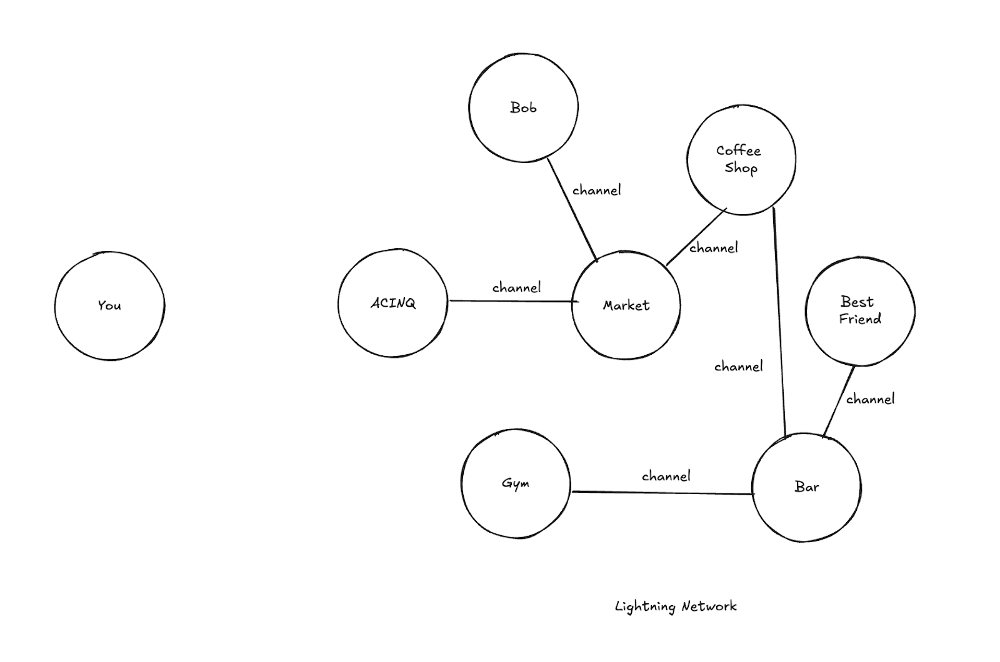
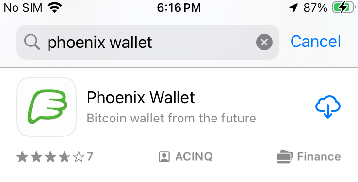
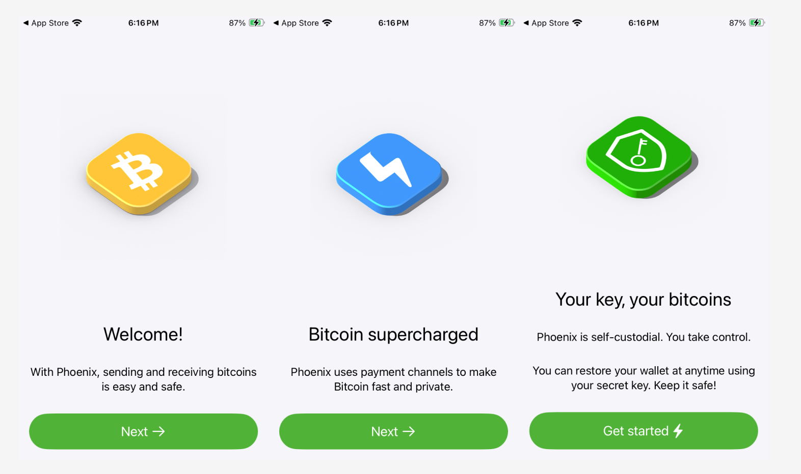
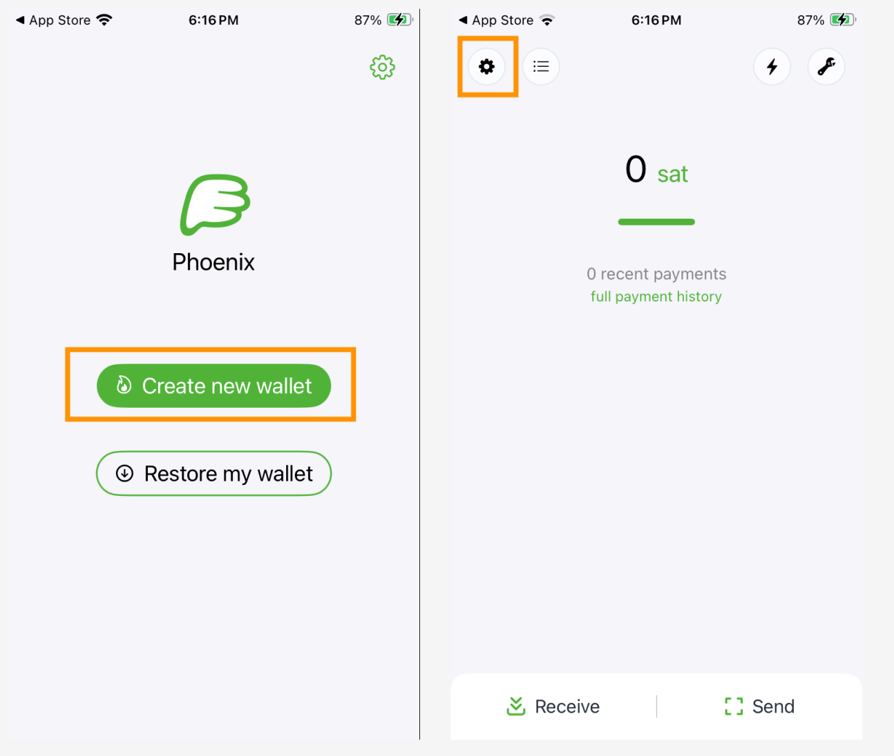
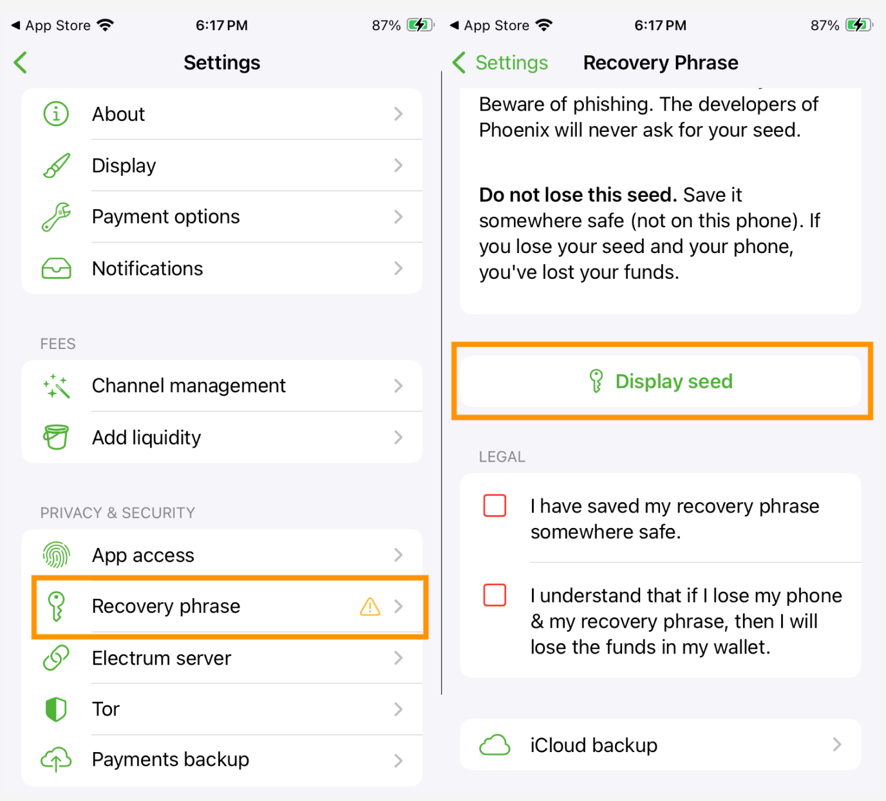
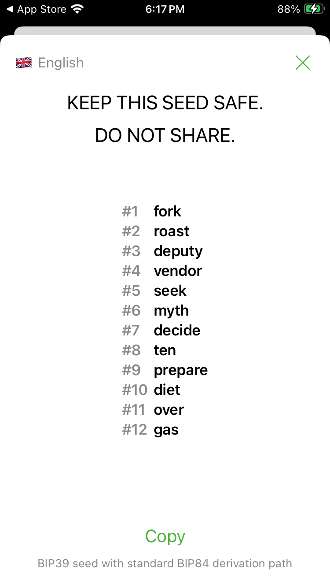
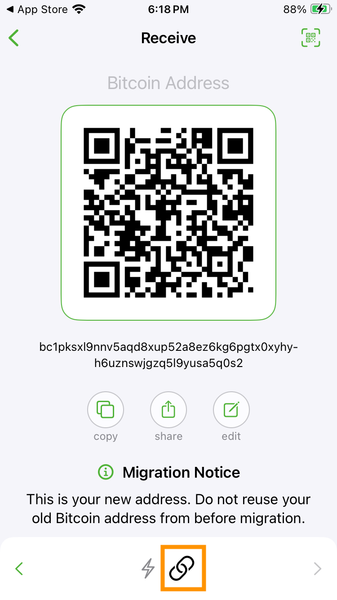
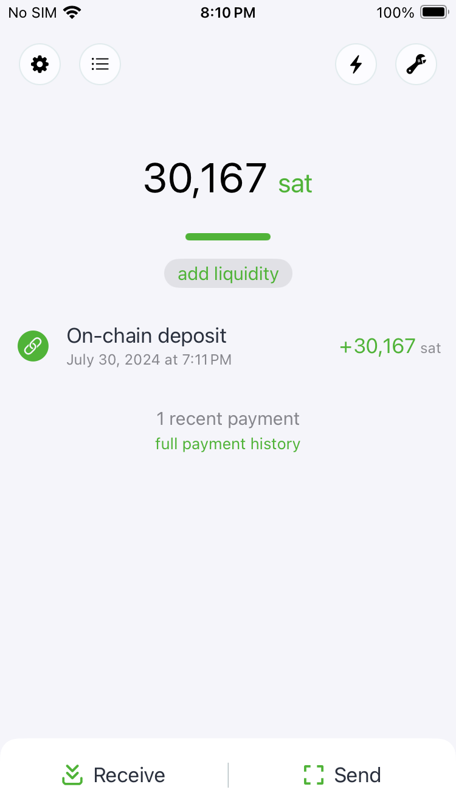
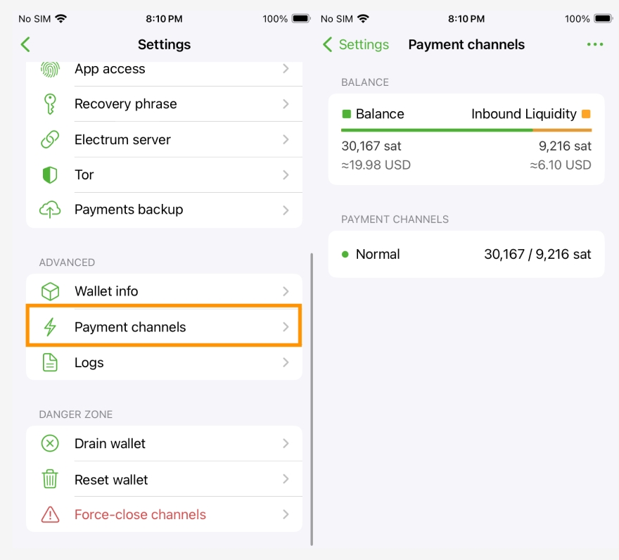
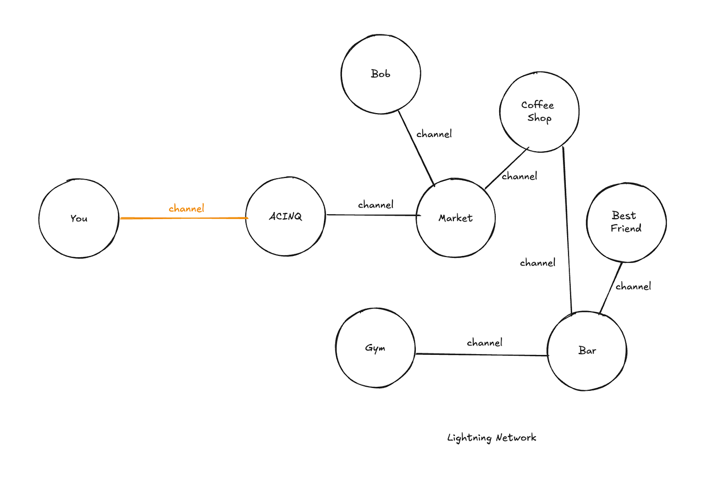

# 9. Lightning Network

You can find the Mastering the Lightning Network textbook translated to pt-BR in this repository: https://github.com/biohazel/lnbook-pt-br.

The Lightning Network is a decentralized system for instant, high-volume micropayments that eliminates the risk of delegating custody of funds to trusted third parties. Bitcoin, the most widely used and valuable digital currency in the world, allows anyone to send value without an intermediary or trusted deposit. Bitcoin contains an advanced scripting system that allows users to program instructions for funds. However, there are some drawbacks to Bitcoin's decentralized design.

Confirmed transactions on the Bitcoin blockchain take up to an hour to become irreversible (approximately 6 confirmations, or 6 blocks deep). Micropayments, or payments smaller than a few cents, are inconsistent, and fees make these transactions unfeasible on the network currently.

The Lightning Network solves several scalability and cost issues of Bitcoin. It is one of the first implementations of a multiparty smart contract (programmable money) using Bitcoin's built-in script. The Lightning Network is leading technological development in multiparty financial transactions with Bitcoin, enabling fast, low-cost, and off-chain transactions.

**Instant Payments**: Bitcoin aggregates transactions in blocks spaced ten minutes apart. Payments are widely considered secure on Bitcoin after confirmation of six blocks, or about an hour. In the Lightning Network, payments do not need block confirmations and are instant and atomic. Lightning can be used at retail point-of-sale terminals, with device-to-device transactions, or anywhere instant payments are needed.

**Micropayments**: New markets can be opened with the possibility of micropayments. Lightning allows sending funds as small as 0.00000001 bitcoin without custody risk. The Bitcoin blockchain currently imposes a minimum output size many hundreds of times larger and a fixed fee per transaction, making micropayments impractical. Lightning allows minimum payments denominated in bitcoin, using real bitcoin transactions.

**Scalability**: The Bitcoin network will need to support orders of magnitude higher transaction volume to meet the demand for automated payments. The imminent increase in internet-connected devices needs a platform for machine-to-machine payments and automated micropayment services. Lightning Network transactions are conducted off the blockchain without delegating trust and ownership, allowing users to conduct nearly unlimited transactions between other devices.

**How It Works**: Funds are placed in a bitcoin "channel" address with multiple signatures from two parties. This channel is represented as an entry in Bitcoin's public ledger. To spend funds from the channel, both parties must agree on the new balance. The current balance is stored as the most recent transaction signed by both parties, spending from the channel address. To make a payment, both parties sign a new outgoing transaction spending from the channel address. All old outgoing transactions are invalidated by doing this.

The Lightning Network does not require counterparty cooperation to exit the channel.
Both parties have the option to unilaterally close the channel, ending their relationship. Since all parties have multiple channels with different users on this network, it is possible to send a payment to any other party through this network. By embedding the payment conditioned on the knowledge of a secure cryptographic hash, payments can be made through a network of channels without any party having unilateral ownership of the funds.

The Lightning Network enables what was previously impossible with trusted financial systems vulnerable to – without the need for trust and custody, network participation can be dynamic and open to all.

Scalability is one of the main challenges faced by the Bitcoin network. This term refers to Bitcoin's ability to process a large number of transactions quickly and efficiently. Here are some specific challenges:
- Block Size Limit: Each block on the Bitcoin blockchain has a maximum size of 1 megabyte. This limits the number of transactions that can be included in each block, resulting in a maximum capacity of approximately 7 transactions per second. This is relatively small compared to traditional payment systems, such as credit card networks, which can process thousands of transactions per second.
- Confirmation Time: The average time to mine a block is about 10 minutes. During periods of high demand, transactions can take a long time to be confirmed, causing significant delays.
- Transaction Fees: When the network is congested, transaction fees increase as users compete to have their transactions included in the next blocks. This can make using Bitcoin expensive, especially for lower-value transactions.

The Lightning Network is a layer 2 solution designed to address Bitcoin's scalability issues. It allows fast, low-cost transactions by moving them off the main blockchain (off-chain). Here's how the Lightning Network works and how it addresses scalability challenges.

**Payment Channels**: The Lightning Network uses peer-to-peer payment channels. Two users can open a payment channel by establishing an initial transaction on the Bitcoin blockchain. Once the channel is open, they can perform an unlimited number of transactions between themselves without having to record each individual transaction on the blockchain.

**Off-Chain Transactions**: Transactions made within a payment channel are recorded only by the two channel participants, not burdening the Bitcoin blockchain. Only the opening and closing of the channel are recorded on-chain, significantly reducing the amount of data processed on the blockchain.

**Low Fees and High Speed**: Since transactions on the Lightning Network do not require confirmation from miners, they are almost instantaneous and have much lower fees. This makes it feasible to use Bitcoin for small everyday transactions, such as buying a coffee or paying for an online service.

**Network of Channels**: The Lightning Network consists of a network of interconnected payment channels. Even if two users do not have a direct channel between them, they can send transactions through multiple intermediary channels, as long as there is an available path. This significantly extends the utility of the Lightning Network.

**Security**: Despite operating off-chain, the Lightning Network still benefits from the security of the main Bitcoin blockchain. If there is any attempt at fraud or disagreement between participants, Lightning Network rules allow users to revert to the main blockchain to resolve disputes.

The Lightning Network solves Bitcoin's scalability issues by moving most transactions off the main blockchain, allowing for fast, cheap, and secure transactions. This increases the capacity of the Bitcoin network and makes the system more efficient and scalable for broader use.

### 9.1 BOLTs—Basics of Lightning Technology

The Basics of Lightning Technology (BOLT) are the standardized technical specifications for the Lightning Network, defining how various implementations can interoperate within the same network. The official repository is at: https://github.com/lightning/bolts

The process of creating, evaluating, developing, and testing a BOLT is collaborative and rigorous, involving multiple stages of review, testing, and refinements. This process ensures that proposed improvements to the Lightning Network are technically sound, secure, and beneficial to the community as a whole.

The submission and approval process for a BOLT is analogous to the process for Bitcoin Improvement Proposals (BIPs). Learn about the BOLTs currently implemented.

- [BOLT 1: Basics of Lightning Technology (BOLTs) Description](https://github.com/lightning/bolts/blob/master/01-messaging.md): This BOLT provides an overview of the Lightning Network, explaining the fundamental concepts and objectives. It defines the structure and purpose of the BOLTs, which serve as standardized documents for protocol specifications. Example Application: A new developer to the Lightning Network can consult this BOLT to understand the general architecture and purpose, guiding their initial development efforts.
- [BOLT 2: Peer Protocol for Channel Management Description](https://github.com/lightning/bolts/blob/master/02-peer-protocol.md): Specifies the protocol for managing channels between peers, including establishment, closure, and message exchange. Example Application: Implementation of a Lightning node that can open and close payment channels with peers, ensuring compliance with the network protocol.
- [BOLT 3: Bitcoin Transaction and Script Formats Description](https://github.com/lightning/bolts/blob/master/03-transactions.md): Details the transaction and script formats used in the Lightning Network, including funding transaction details and the structure of commitment transactions. Example Application: Creation of custom transactions or scripts for advanced features, such as custom lock times or conditional payments.
- [BOLT 4: Onion Routing Protocol Description](https://github.com/lightning/bolts/blob/master/04-onion-routing.md): Describes the onion routing protocol used for private and secure multi-hop payments. Includes details on packet structure, encryption, and routing process. Example Application: Development of secure payment routing logic in a Lightning wallet or service, ensuring user payments are routed confidentially through the network.
- [BOLT 5: On-Chain Handling of the Lightning Network Description](https://github.com/lightning/bolts/blob/master/05-onchain.md): Provides guidelines for handling on-chain transactions (cooperative or forced channel closure), including channel monitoring and breach remedy transactions. Example Application: Implementation of "watchtower" services that monitor the blockchain for potential fraud or breaches and take corrective actions.
- **BOLT 6: Commitment Transaction Specification Description**: Defines the structure and rules for commitment transactions, which are the core of channel state updates. Example Application: Ensuring a Lightning node correctly handles commitment transactions to maintain channel integrity and prevent losses.
- [BOLT 7: P2P Node and Channel Discovery Description](https://github.com/lightning/bolts/blob/master/07-routing-gossip.md): Describes the protocols for node and channel discovery, allowing nodes to find peers and learn about the network topology. Example Application: Enhancing a Lightning node's ability to dynamically discover and connect to new peers, improving network connectivity and robustness.
- [BOLT 8: Encrypted and Authenticated Transport Description](https://github.com/lightning/bolts/blob/master/08-transport.md): Specifies the encrypted and authenticated transport layer protocol for secure communication between nodes. Example Application: Ensuring secure communication channels in a Lightning node implementation, guaranteeing all messages are encrypted and authenticated.
- [BOLT 9: Assigned Feature Flags Description](https://github.com/lightning/bolts/blob/master/09-features.md): Lists the feature flags used in the Lightning Network to signal optional protocol features a node supports. Example Application: Development of Lightning applications that can negotiate supported features with peers, ensuring compatibility and rich interaction.
- [BOLT 10: DNS Bootstrap and Assisted Node Location Description](https://github.com/lightning/bolts/blob/master/10-dns-bootstrap.md): Defines the use of DNS for initial node connection and assisted node location. Example Application: Implementation of initial connection logic in a Lightning wallet using DNS to find and connect to the Lightning Network.
- [BOLT 11: Invoice Protocol for Lightning Payments Description](https://github.com/lightning/bolts/blob/master/11-payment-encoding.md): Specifies the format for Lightning payment invoices, including details like amount, payment hash, and expiration time. Example Application: Generation and decoding of payment invoices in a Lightning payment processor, enabling users to make and receive payments easily. https://www.bolt11.org/

Although BOLT 12 is still actively under development and has not yet been formally integrated into the main BOLTs repository, it offers several improvements over BOLT 11. These enhancements include support for static offers (which means that a single QR code can be generated and used repeatedly for payments. This contrasts with BOLT 11, where each payment required a unique QR code), recurring payments, blinded paths, and onion messaging. For more specific details and updates, it is recommended to follow the discussions on the [lightning-dev mailing list](https://lists.linuxfoundation.org/pipermail/lightning-dev/) and the relevant development repositories.

These BOLTs ensure the Lightning Network operates efficiently, securely, and interoperably, providing developers with the necessary standards to create robust and feature-rich applications.

The BOLTs (Basis of Lightning Technology) are collaboratively managed by the Lightning Network community developers. Developers of various Lightning Network clients, such as LND (Lightning Network Daemon), Éclair, and Core Lightning, contribute and ensure their software's compatibility with these standards.

Discussions and development proposals take place on the lightning-dev mailing list and social networks like Nostr and X.

### 9.2 Payment Channels

The Lightning Network is an innovative solution to the scalability and cost problems of on-chain Bitcoin transactions. It enables fast, low-cost transactions to be conducted off-chain through payment channels. These channels are built on 2-of-2 multisig addresses, timelocks, and Segregated Witness transaction outputs, providing a secure and efficient way to move bitcoins between users without the need to record each transaction on the main blockchain.

To better understand how to manage and optimize the capacity of these channels, it's important to know the various options available, including opening new channels, splicing techniques, channel rebalancing, submarine swaps, channel factories, and dual-funded channels. Additionally, third-party liquidity providers can be used to add funds to your channels, increasing the flexibility and efficiency of your transactions on the Lightning Network.

To increase the capacity of a channel on the Lightning Network, you have several options, including splicing. Here are the main options:

- **Open a New Channel**: Open a new channel with the additional amount of bitcoins you want to have available. This can be done independently or with the same channel partner, increasing the total capacity available for your transactions on the Lightning Network.
- **Splicing**: Splicing is a technique that allows adding or removing funds from an existing channel without closing it. There are two main types of splicing:
  - **Splice-In**: Add funds to the existing channel. This involves an on-chain transaction that adds more bitcoin to the channel, increasing its capacity.
  - **Splice-Out**: Remove funds from the channel, allowing you to withdraw part of the channel balance without completely closing the channel.
- **Channel Rebalancing**: Rebalancing the channel means moving funds between your existing channels to optimize liquidity without needing to close or open new channels. This can be done by sending payments to yourself through the Lightning Network to redistribute the balance between channels.
- **Loop In/Loop Out (Submarine Swaps)**: Using submarine swaps, you can move funds between the Lightning Network and the main blockchain without closing channels. There are two types:
  - **Loop In**: Move funds from the main blockchain to a Lightning channel.
  - **Loop Out**: Move funds from a Lightning channel to the main blockchain.
- **Channel Factories**: Channel Factories allow the creation of multiple payment channels between several parties using a single initial on-chain transaction. This can increase the efficiency and overall capacity of the channels.
- **Dual-Funded Channels**: Dual-funded channels allow both parties to contribute funds when opening the channel, increasing the initial capacity without requiring one party to fund the entire channel.
- **Third-Party Liquidity Providers**: You can use third-party liquidity providers who can add funds to your channels in exchange for a fee. This is particularly useful for users who need additional capacity without wanting to open new channels directly.

These options provide flexibility to manage and optimize the capacity of your channels on the Lightning Network, ensuring you have the necessary liquidity to conduct efficient and fast transactions.

A payment channel is simply a 2-of-2 multisig address on Bitcoin, for which you hold one key, and your channel partner holds the other key. To open a channel on Lightning, the channel effectively gives you access to the entire network. You first need to send on-chain bitcoin to your channel opening address.

The value of the on-chain transaction you make will be your spending credit. To make a payment larger than this first on-chain transaction, you would need to open another channel or increase the liquidity of your channel.

To reinforce, payment channels are built on 2-of-2 multisig addresses, timelocks, and Segregated Witness transaction outputs.

- **Channel Opening**: A channel is opened after the multisig address receives an initial on-chain funding transaction.
- **Off-Chain Payments**: The parties in the channel can make off-chain payments between themselves, updating the channel balance over time as much as they want.
- **Channel Closing**: Either participant can decide to close the channel, cooperatively or non-cooperatively, at any time.
- **Balance Settlement**: When the channel is closed, the balance will be settled through an on-chain transaction.

### Hypothetical Example with Three Parties (A, B, C) in Routing

- **Initial Scenario**:
  - Participants: A, B, and C. Payment Channels:
  - A has a payment channel with B.
  - B has a payment channel with C.
- **Payment from A to C**:
  - A updates its balance with B:
  - A wants to send 1 BTC to C.
  - A and B update their payment channel: A decreases its balance by 1 BTC and B increases its balance by 1 BTC.
  - This process is carried out through a Hash Time-Locked Contract (HTLC), ensuring the transaction is only completed if all participants agree.
  - B updates its balance with C:
  - B, now with 1 BTC more, sends this 1 BTC to C.
  - B and C update their payment channel: B decreases its balance by 1 BTC and C increases its balance by 1 BTC. Again, this is done using an HTLC for security and synchronization.
- **Payment from C to A**:
  - C pays B:
  - If C wants to send 1 BTC to A, the process is similar, but in the opposite direction.
  - C and B update their payment channel: C decreases its balance by 1 BTC and B increases its balance by 1 BTC, using an HTLC.
  - B pays A:
  - B, now with 1 BTC more, sends this 1 BTC to A.
  - B and A update their payment channel: B decreases its balance by 1 BTC and A increases its balance by 1 BTC, also using an HTLC.

### How HTLC (Hash Time-Locked Contract) Works

HTLC is a type of smart contract that ensures the security of transactions on the Lightning Network. It allows a payment to be made only if a certain condition is met, such as presenting a secret (hash preimage) or meeting a time limit. This prevents funds from being lost or stolen during payment routing.

This structure allows fast and cheap transactions, using the security of the Bitcoin network but without the need to record each individual transaction on the blockchain, increasing the system's scalability and efficiency.

Learn more at https://lightning.network/

### 9.3 Lightning Nodes

Below are the different ways to interact with the Lightning Network and the main applications that provide these services. This variety of options allows developers and users to choose the approach that best suits their needs and preferences.

#### Full Node

Running a full Lightning Network node involves operating a full Bitcoin node and a Lightning node anchored to it. This offers maximum security and control but requires more hardware resources and technical knowledge. Tools like Ride The Lightning are extremely useful for managing full Lightning nodes. Below are some popular Lightning node implementations.

- **LND (Lightning Network Daemon)**: Developed by Lightning Labs, it is one of the most popular implementations for running a full node. It offers a wide range of functionalities and APIs for developers.
- **c-lightning**: Developed by Blockstream, it is a lightweight and modular implementation of the Lightning protocol, offering flexibility for customizations.
- **Eclair**: Developed by ACINQ, it is a robust Lightning Network implementation focused on full nodes, with support for various advanced features.

#### Light Node

Light nodes do not require running a full Bitcoin node. They rely on third-party full nodes to verify transactions and blocks, making them easier to set up and operate.

#### Custodial Wallets

Custodial wallets are managed by third parties, meaning the responsibility for funds is transferred to the company providing the service. They are easy to use and ideal for beginners.

- **Wallet of Satoshi**: A custodial wallet that offers a user-friendly interface for Lightning Network transactions. https://www.walletofsatoshi.com/

#### Non-Custodial Wallets—100% User-Controlled

Non-custodial wallets allow users to maintain full control over their private keys and funds, offering greater security and privacy.

- **Phoenix Wallet**: Developed by ACINQ, it is a mobile wallet that acts as a light node, allowing fast and secure transactions on the Lightning Network. When you create a wallet with Phoenix, it automatically opens a channel with ACINQ, the most well-connected and liquid node in the network. https://phoenix.acinq.co/
- **Zeus Wallet**: Allows users to connect to their own LND, c-lightning, or Electrum nodes, offering full control over funds and transactions. It is empowering to be anywhere in the world and transact via a VPN connection directly from your full node at home. It is complete financial self-sovereignty. Learn more at: https://zeusln.com/

### 9.4 Network Explorers

Lightning Network explorers allow users to check the state of channels, transactions, and other relevant data publicly.

- [1ML](https://1ml.com/): A network explorer and node directory for the Lightning Network, offering visualizations of channels, capacities, and node information.
- [Amboss](https://amboss.space/): Another explorer that provides a user-friendly interface for exploring the Lightning network topology and detailed information about nodes and channels.

These various ways of interacting with the Lightning Network provide a range of options adaptable to different levels of technical knowledge and security requirements. With these tools, both developers and users can engage efficiently and securely with the Lightning Network.

### 9.5 Practice: My First Bitcoin on the Lightning Network

Time to experience a Bitcoin transaction via Lightning. When we transact Bitcoin on-chain, as we did previously, the term used is "transaction." In the case of the Lightning Network, the term used is "payment" because we essentially make payments for invoices. Through the keysend function, we can send arbitrary amounts to people, but we still call them payments.

To interact with the Lightning Network, you need to open a first channel that will potentially give you access to all the nodes in the network, depending on how well-connected it is. The ACINQ node is one of the best-connected and also one of the largest in terms of liquidity (amount of bitcoins allocated).

The Phoenix wallet, developed by ACINQ, facilitates this channel-opening process with them, allowing you to enjoy instant and low-fee payments on the Lightning Network. Before having our first channel open, we cannot make or receive payments via Lightning. The situation is illustrated below.

To make our first transaction on Lightning, we will use the Phoenix wallet.

There will be 3 initial screens; click Next, Next, and Get started.

Now choose Create new wallet. Then click on the Settings icon to find and note down your wallet recovery mnemonic phrase.

Click on Recovery phrase and then on Display seed.

Write down your seed carefully.

Now, click the x, then Receive, and click on the chain icon.

This address on the screen is an on-chain address for your wallet. Now that you know how to make on-chain transactions, you can open your BlueWallet and send an amount to this address. This amount will be the capacity of your channel on the Lightning Network.

Think of it as a prepaid account, an amount of bitcoin that is 'locked' in the channel but that you can use to send and receive bitcoin with very low fees and instant speed.

**In a world where Bitcoin is a medium of exchange, you might open a channel on Lightning and never close it. Now that you know almost everything about Bitcoin, set up a circular economy in your community, and this reality will come sooner than you think.**

Initially, when you open a channel on the Lightning Network, you only have outbound capacity, meaning you can send bitcoins but not receive them. There are tools that help balance the channels so that you can both send and receive. The Phoenix wallet manages this automatically.

After sending the satoshis from your other wallet, you will see the amount on the main screen.

Again in Settings, look for Payment channels, and you will see your first channel open on Lightning.

Congratulations! You are now using the best L2 (Layer 2, off-chain) solution for Bitcoin. The procedure to pay or generate Lightning invoices is completely intuitive, through the Send and Receive buttons, with options for QR Code and written code. The important thing is that you are now operating via Lightning through Phoenix. Now, if someone asks you if they should pay you on-chain or via Lightning, you know the answer.

