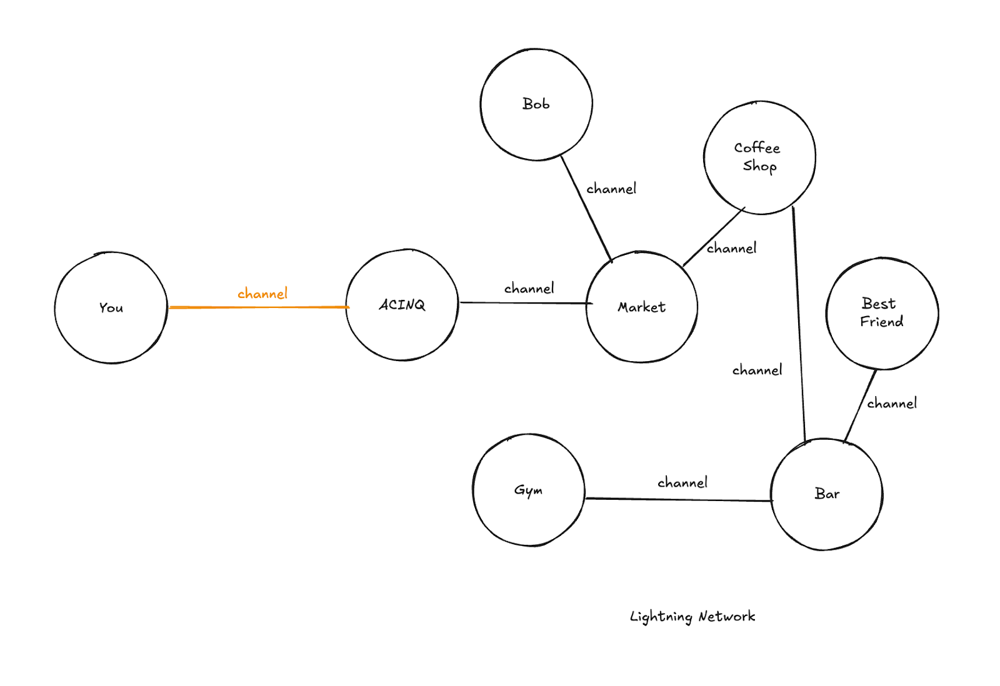

### 10. Freedom Technologies

#### 10.1 Cypherpunks

Bitcoin was created as a response to the limitations of the traditional financial system and emerged from a quest for human freedom. This movement was strongly influenced by the cypherpunk community, a group of technological activists who advocate the use of cryptography to protect privacy and promote individual freedom.

Cypherpunks are known for their vigorous advocacy of using cryptography to ensure privacy and freedom of expression in the digital age. Formed in the 1990s, this community comprises programmers, cryptographers, and privacy advocates who believe cryptography is essential to maintaining personal freedom against government surveillance and control.

The philosophy of cypherpunks is rooted in the belief that privacy is fundamental to human freedom. They advocate for the creation and use of technologies that can protect personal communications and transactions from any form of surveillance or censorship.

The creation of Bitcoin by Satoshi Nakamoto in 2008 was heavily influenced by cypherpunk ideals. Nakamoto was involved in discussions about cryptography and digital currencies, and Bitcoin represents a practical implementation of the ideas championed by cypherpunks: a decentralized and anonymous financial system.

The cypherpunk movement began in the late 1980s and early 1990s. It was founded by individuals like Eric Hughes, Timothy C. May, and John Gilmore.

In 1993, Eric Hughes published the [Cypherpunk Manifesto](https://www.activism.net/cypherpunk/manifesto.html), which outlined the movement's principles and goals. He emphasized the importance of privacy and the use of cryptography to achieve it.

Cypherpunks believe that privacy is essential for a free society and that it must be protected against intrusions. They use and promote strong cryptography to protect communications and personal data and advocate for decentralized systems that do not rely on central authorities, as these systems are less susceptible to censorship and control.

##### Technologies and Contributions of the Cypherpunk Community

**PGP (Pretty Good Privacy)**: One of the earliest and most well-known encryption software, created by Phil Zimmermann, a member of the cypherpunk community. Developed in 1991, PGP allowed anyone to effectively protect their electronic communications. Zimmermann became a symbol of the fight for digital privacy, receiving numerous awards and recognitions for his contributions to information security.

Zimmermann's struggle, facing retaliation from the U.S. government in the 1990s, helped solidify the importance of digital privacy as a fundamental right. In 1993, he was the subject of a criminal investigation for alleged violations of arms export regulations since PGP was considered military-grade encryption technology. However, after intense public pressure and support campaigns, the case was dropped without formal charges in 1996.

Zimmermann's advocacy for strong encryption influenced policies and regulations worldwide, promoting the adoption of digital security technologies by both individuals and companies. His work continues to impact digital security today, establishing encryption as an essential tool for protecting privacy and freedom of expression in the digital age.

In the context of Bitcoin development, for example, it is good practice for developers to sign their commits with their PGP keys. Learn more at [https://docs.github.com/en/authentication/managing-commit-signature-verification/signing-commits](https://docs.github.com/en/authentication/managing-commit-signature-verification/signing-commits).

**Tor**: The cypherpunk movement directly influenced the creators of Tor. The Tor network (The Onion Router) was originally developed by the U.S. Naval Research Laboratory in the mid-1990s. The project began with the need to protect the U.S. government's online communications. In 2002, Tor was released to the public to provide internet anonymity.

**Bitcoin**: Although Satoshi Nakamoto, the creator of Bitcoin, was not a declared member of the cypherpunk community, many of Bitcoin's principles and ideas were influenced by cypherpunk philosophy.

**Lightning Network**: Although the Lightning Network was not explicitly created by cypherpunks, it incorporates many of the fundamental values of cypherpunk philosophy, such as privacy, decentralization, and efficiency. These characteristics are reflected in the design decisions that allow for fast and private transactions while maintaining Bitcoin's security and decentralization. The LN continues to evolve as a crucial solution for scaling Bitcoin while adhering to its fundamental principles.

Many cypherpunks are activists fighting against mass surveillance and internet censorship, advocating for policies that protect digital privacy and freedom. The philosophy and technologies developed by the cypherpunk community have significantly influenced digital security and online privacy protection. They have played a crucial role in developing many of the digital security technologies we use today.

The influence of cypherpunks continues to be felt in the development of new privacy and security technologies. Projects that follow cypherpunk principles continue to emerge, always seeking to protect individual freedom in the digital world.

**The open-source Bitcoin development ecosystem is tied to the philosophy of protecting privacy and human freedom.**

Many applications integrated with Bitcoin follow this design logic, and it is especially gratifying to know that your talent is being used to build relevant tools to liberate humanity. Here are some examples of important projects in the ecosystem, many of which offer paid opportunities for developers.

#### 10.2 JoinMarket e Jam

JoinMarket is a powerful tool that significantly enhances the privacy of Bitcoin transactions through a process called CoinJoin. Developed to facilitate the mixing of Bitcoin transactions, JoinMarket connects users who want to anonymize their transactions with those who provide liquidity for the process.

JoinMarket utilizes the concept of CoinJoin, where multiple transactions are combined into a single joint transaction, making it difficult to trace the funds. Here is a step-by-step guide on how JoinMarket works. There are two main types of users in JoinMarket:
- **Makers**: Provide liquidity for CoinJoin by offering their funds to be mixed. In return, they receive a small fee.
- **Takers**: Initiate the CoinJoin transaction and pay a fee to the Makers to mix their coins.

Users need to set up a JoinMarket wallet, which can be done via the command-line interface or the optional graphical interface. The wallet connects to the Bitcoin network to carry out transactions.

**CoinJoin Process**
- Makers announce their liquidity offers on the JoinMarket network.
- Takers select the Makers' offers and initiate a CoinJoin transaction.
- The combined transaction is created, signed by all participants, and sent to the Bitcoin network.

Use the "daemon" mode to run JoinMarket in the background, facilitating continuous CoinJoin processes. Regularly participate in CoinJoins to increase the privacy of your transactions. Combine JoinMarket with other privacy practices, such as using new addresses for each transaction.

**Installing JoinMarket**
To install JoinMarket, you can clone the official GitHub repository and follow the installation instructions. Here are the detailed steps:

Clone the JoinMarket repository:

```git clone https://github.com/JoinMarket-Org/joinmarket-clientserver.git```

```cd joinmarket-clientserver```

Run the installation script:

```./install.sh```

Configuring the Wallet. Create the configuration file:

```cp cfg/joinmarket.cfg.example cfg/joinmarket.cfg```

Edit the ```joinmarket.cfg``` file as necessary, especially the section for configuring the connection with Bitcoin Core.

Start the JoinMarket daemon:

```jmwalletd```

Refer to the JoinMarket [installation](https://github.com/JoinMarket-Org/joinmarket-clientserver/blob/master/docs/INSTALL.md) guide and [user guide](https://github.com/JoinMarket-Org/joinmarket-clientserver/blob/master/docs/USAGE.md) for more details.

### Contributing to the Project
- Familiarize yourself with the JoinMarket repository on GitHub, where you can find the source code and open pull requests to contribute improvements.
- Participate in community discussions to understand the needs and priorities of users.
- Work on user interface improvements to make JoinMarket more accessible to non-technical users.
- Contribute to the documentation, helping new users set up and use JoinMarket effectively.

Unlike other centralized mixers, JoinMarket is decentralized, eliminating the need to trust an intermediary service. Makers are economically incentivized to provide liquidity by receiving fees from Takers.

JoinMarket allows users to choose their own fees and offers, providing flexibility in using the service. It represents a crucial tool for those who value privacy in Bitcoin usage. With an active community of developers and users, the platform continues to evolve, offering effective methods to anonymize transactions and protect users' financial privacy.

### JAM (Joinmarket-API-Interface)
JAM is an advanced, user-friendly interface for JoinMarket, designed to facilitate the use of CoinJoin and improve the user experience, especially for those who are not technically inclined.

JAM is a browser-based application that offers a graphical user interface (GUI) to interact with JoinMarket. Developed to be intuitive and accessible, it allows users to set up and manage their JoinMarket wallets, participate in CoinJoins, and monitor their transactions with ease.

JAM represents a significant advancement in the usability of JoinMarket, offering an accessible and user-friendly interface that makes participating in CoinJoin transactions easier and improves the privacy of Bitcoin users. Both users and developers are encouraged to explore and contribute to the project, helping to build a more robust and secure tool for everyone.

For more information and detailed instructions on how to get started, visit the official [JAM repository on GitHub](https://github.com/joinmarket-webui/jam).

### 10.3 E-cash—Federated Chaumian Mints
Chaumian e-cash is a crucial technology for preserving privacy in digital transactions, conceived by [cryptographer David Chaum](https://github.com/biohazel/articles/blob/main/chaum.PDF). It enables the creation of digital coins that are anonymous and untraceable, utilizing advanced cryptographic techniques such as blind signatures. This technology is of particular interest to developers looking to create private and secure payment systems.

While Bitcoin uses a different model to ensure transaction security and privacy, Chaum's concept of blind signatures has significantly contributed to the understanding of anonymous and decentralized transactions that led to Bitcoin. The combination of these two systems favors Bitcoin's scale as a financial system that truly preserves user privacy.

**How Chaumian E-cash Works**
Chaumian e-cash is a system that uses blind signatures to ensure that the entity issuing the money cannot link the user's identity to subsequent transactions. This is achieved through a process where digital tokens are blindly signed by the issuer, and only the token holder can spend them without revealing their identity.

It consists of two main components: the mint and the e-cash wallet. The technology allows anyone to operate a mint for their application, which can range from digital wallets to voucher and reward systems.

E-cash tokens issued by the mint have a 1:1 parity with Bitcoin. This means that for every e-cash token issued, there is an equivalent amount of Bitcoin held in reserve. Users can easily convert their e-cash tokens back into Bitcoin, ensuring liquidity and usability of funds.

Chaumian e-cash combines the privacy of blind signatures with the efficiency and scalability of the Lightning Network. This combination of privacy, security, and efficiency makes Chaumian e-cash a robust solution for anonymous financial transactions. Learn more about the components of an E-cash system.

- **Mint**: The mint is responsible for issuing e-cash tokens. When a user deposits Bitcoin, the mint creates equivalent e-cash tokens using blind signatures. This process ensures that the mint cannot track the future transactions of these tokens. A mint does not store a database of user accounts and their activities, protecting users of an E-cash system from data leaks to hackers and providing stronger censorship resistance than traditional payment systems.

- **E-cash Wallet**: Users keep their e-cash tokens in digital wallets, which can be used for transactions. These transactions respect user privacy as the tokens are spent anonymously.

E-cash transactions between users, or from users to service providers, are conducted in a way that protects the sender's and receiver's identities. Anyone can operate a mint for their application, whether it's a wallet, a web paywall, paid streaming services, or a voucher and rewards system.

Chaumian e-cash represents a crucial piece in building financial freedom technologies alongside Bitcoin. Projects like Cashu and Fedimint exemplify how this technology can be applied to create private and secure payment systems, offering ample opportunities for developers willing to contribute to the advancement of the open-source Bitcoin ecosystem and financial freedom.

**Cashu**
Cashu is an e-cash protocol integrated with the Bitcoin protocol. It is a project that implements Chaumian e-cash to create a private and user-friendly Bitcoin transaction platform. Users can deposit Bitcoin and receive equivalent e-cash tokens that can be spent anonymously within the system. The main benefit of Cashu is user privacy protection, as transactions made with e-cash tokens cannot be traced.

Cashu is primarily focused on providing a simplified and private way to use Bitcoin, emphasizing ease of use and transaction privacy. It is designed to be lightweight and easy to implement, making it accessible for developers who want to integrate private Bitcoin transactions into their applications.

Developers interested in contributing to Cashu will find various open-source work opportunities. They can get involved in implementing privacy protocols, improving the efficiency of blind signatures, and creating user interfaces that facilitate the adoption of the technology by a broader audience.

Learn more at: [https://docs.cashu.space/](https://docs.cashu.space/)

**Fedimint**
Fedimint is another innovative project that uses Chaumian e-cash but with a federated approach to Bitcoin custody and management. In this system, a federation of trusted entities collaborates to issue and manage e-cash tokens.

The federation uses multi-signatures (multi-sig) to approve the issuance and redemption of tokens, distributing trust among multiple participants and mitigating security risks. The decentralization of the federation ensures no single point of failure in mint management.

For developers, Fedimint offers a fertile ground for contributing to decentralized security and financial privacy. Opportunities include implementing more robust multi-sig schemes, optimizing communication between federation members, and developing tools that facilitate the creation of federations in different communities.

Implementing and improving technologies like Chaumian e-cash in projects like Cashu and Fedimint open up numerous opportunities for developers. Contributing to these projects not only helps strengthen the privacy and security of financial transactions but also positions developers at the forefront of technological innovation in the Bitcoin space.

Participating in these projects offers the chance to work with cutting-edge technologies, collaborate with a global community of developers, and contribute to building fairer and more private financial systems.

Whether improving cryptographic algorithms, developing intuitive interfaces, or implementing decentralized custody solutions, the possibilities are vast and impactful.

Learn more at: [https://fedimint.org/](https://fedimint.org/)

### 10.4 Nostr
Tim Berners-Lee, a British computer scientist, invented the World Wide Web (WWW) in 1989 while working at CERN, the particle physics laboratory in Switzerland. Berners-Lee wanted to create a system that would facilitate the exchange of information between scientists at different universities and institutions around the world. In 1991, he launched the first web page and the first web server, making the web public.

Berners-Lee's original vision for the internet was a decentralized and uncensorable network where anyone could freely share and access information. He designed the web as an open space, based on universal and free standards, that would promote global communication and collaboration without barriers.

Over time, technology companies like Google, Facebook, Amazon, and others became dominant on the internet. These Big Tech companies and cloud service providers have centralized a large portion of internet traffic and data. While these companies have facilitated access to information and services, they have also introduced new challenges.

The major platforms have the power to censor content and control what can or cannot be shared. The massive collection of personal data for monetization purposes compromises user privacy. The reliance on centralized servers makes the network vulnerable to failures and attacks.

**The Problem Nostr Solves**
Nostr (Notes and Other Stuff Transmitted by Relays) is a protocol designed to overcome the issues of centralization and censorship on the internet. Unlike traditional social networks and platforms, Nostr was designed to be distributed and censorship-resistant.

Nostr is a simple asynchronous messaging protocol layer. The protocol operates in a decentralized and censorship-resistant manner to ensure freedom of expression. Therefore, it is not an application or service you sign up for; it is a protocol, an open standard that anyone can build upon.

The protocol is based on very simple and flexible event objects and uses standard elliptic curve cryptography for keys and signatures. Since Nostr does not rely on a few central servers to move or store data, it is very resilient and allows censorship-resistant communication between its clients.

Nostr is a decentralized protocol, meaning it is not controlled by any central authority. Instead, the network is just a collection of independently operated data relays (servers). A person can use their personal machine to serve as a relay, ensuring their posted messages are always available (at least from their home server) and volunteering to store and propagate events from other Nostr keys. This means that Nostr as a whole is not vulnerable to censorship or manipulation by any single entity.

Unlike many social media platforms, Nostr does not collect user data to sell to third-party advertisers. No email address, phone number, or government identity is associated with your Nostr account. Much like Bitcoin, the system only knows public keys and cryptographic signatures for authentication.

Nostr offers a unique monetization system for content creators. It is easily integratable with the Lightning Network. Unlike other social media platforms that rely on advertising revenue to pay content creators, Nostr allows creators to monetize their content directly with Bitcoin. Imagine that each of your posts has a button that, when clicked, sends appreciation satoshis. Much better than likes and the hijacking of our attention in the process. These are the famous Nostr Zaps.

The code for Nostr is open source, available for anyone to view, use, and modify. This allows for transparency and collaboration in the development of the protocol. Anyone can contribute to Nostr.

**How Nostr Works**
Each Nostr account is based on a pair of public/private keys. A simple way to think about this is that your public key is your username, and your private key is your password, with one important caveat: unlike a password, your private key cannot be reset if lost. Your public key is usually presented as a string with the prefix npub1, and the private key with the prefix nsec1: Make sure to store your private key in a safe place and not share it with anyone.

By sharing your public key, others can find you. Your private key allows you to publish notes, interact with others, and verify that it is you doing so through cryptographic signatures. Possession of the key also allows you to migrate to other clients. Imagine you have a Twitter account and want to switch to TikTok. Using Nostr, you can do this without needing to inform anyone. You simply use the new client by logging in with your private key.

On Nostr, everyone uses a client (Primal, Damus, Coracle, Amethyst, Iris, Snort, etc.), the window through which you look at the Nostr protocol. To publish something, you write a note, sign it with your private key (this happens automatically when you press send), and send it to multiple relays with redundancy (servers hosted by someone else or by yourself). To get updates from others, you ask multiple relays if they know anything about those other people. Very simple.

Note: If all the relays you used in the past go offline, all your posts will be irretrievable. This is one of the reasons why Nostr allows users to connect to many relays – it ensures a higher degree of backup.

While a relay can block a user from posting anything on it, they cannot prevent someone from posting on other relays or you running your own relay and transmitting your own messages. Since users are identified by a public key, they do not lose their identities or their follower network if they are banned from a relay because they can simply connect to another or run one on their own. This is exactly what makes Nostr decentralized and censorship-resistant.

If you want to ensure your speech is absolutely uncensorable, you can and should run your own relay. This guarantees that you always have a copy of all your posts and interactions on Nostr forever. If you are running your own Bitcoin node with Umbrel, you can easily run your own Nostr relay alongside your Bitcoin node.

Note: If you notice your Nostr client is slow, it is more likely due to the relays you are using. It might be worth adding some additional relays to your client to make the experience more pleasant.

Watch a video of [Uncle Bob Martin](https://www.youtube.com/watch?v=MaxXvcr181c), who wrote the renowned books Clean Code and Clean Architecture, talking about the importance of the Nostr protocol in preserving our freedom of speech.

Learn more at: [https://nostr.com/](https://nostr.com/)

A great Nostr client for beginners is [https://primal.net/home](https://primal.net/home).

For developers, it is essential to familiarize themselves with the NIPs, or Nostr Implementation Possibilities: [https://github.com/nostr-protocol/nips](https://github.com/nostr-protocol/nips).

And this is a list of well-connected relays. The uptime of the relays is important to maintain the redundancy and censorship resistance of the propagated messages: [https://nostr.watch/relays/find](https://nostr.watch/relays/find).

Although Nostr and Bitcoin operate in different domains, their technological and philosophical foundations share many principles. The interoperability between the two technologies can lead to new innovative use cases that combine secure and decentralized communication with private and censorship-resistant financial transactions.

**The Bitcoin + Nostr development ecosystem is rapidly growing, with specialized hackathons for Nostr.**

Snapshot of Primal



This is our Nostr key. Create your account and follow us there.  

```npub1jfk9mxsndnwupaergsyat0myst8pygpz2pyx032dz62pefmz22esrcjf2t```

### 10.5 Value4Value
The modern internet is largely monetized through an advertising-based model, where complex algorithms and corporate interests play a central role. Social media platforms, search engines, and other online services collect vast amounts of user data to personalize ads and maximize engagement.

This model is powered by algorithms that analyze user behavior and preferences, often promoting content that increases retention and usage time.

While effective at generating revenue, this system raises significant concerns about privacy, information manipulation, and censorship.
- Platforms collect personal data, browsing history, and user interactions.
- Using this data, algorithms personalize ads to increase the likelihood of clicks and conversions.
- Algorithms promote content that increases usage time, often prioritizing polarizing or sensationalist content to keep users engaged.
- Commercial surveillance is used to better understand consumer behavior and target specific products and services.
- Companies may censor content that does not align with their commercial or political interests, manipulating public perception and influencing opinions.

**Value 4 Value (V4V) Philosophy**
The Value 4 Value (V4V) philosophy proposes a different approach, where digital content is monetized directly by users through micropayments, promoting a more open and fair ecosystem. This model is facilitated by Bitcoin and the Lightning Network, enabling fast and low-cost transactions.
- Using Bitcoin and the Lightning Network, content creators can receive direct payments from their users, eliminating the need for intermediaries.
- Transactions are transparent and respect user privacy, avoiding excessive data collection.
- Users are encouraged to directly support the content and creators they value, creating a more direct and honest relationship.
- User feedback is valued and integrated into the creation process, promoting greater connection and community participation.

**Nostr + Zaps**
Zaps are micropayments made through the Lightning Network that integrate directly with the Nostr network to support content and creators. They represent a practical implementation of the Value 4 Value (V4V) philosophy.

Nostr —Zaps: [awesome-nostr](https://github.com/aljazceru/awesome-nostr), [Nostr Apps](https://github.com/aljazceru/nostr-apps)

Other examples of platforms that enable a V4V culture:
- Crowdfunding: [Geyser Fund](https://geyser.fund/)
- Podcasting: [Fountain](https://www.fountain.fm/)
- Scheduling Meetings: [LNCal](https://lncal.com/)

The Value 4 Value philosophy represents an important shift from advertising-based and surveillance-based monetization to a more fair and open model. By promoting transparency, privacy, and direct user engagement, V4V aims to create a digital ecosystem where value is directly exchanged between creators and consumers, without the interference of intermediaries.

This approach not only empowers content creators but also promotes freedom of expression and resistance to censorship, aligning with the principles of decentralization and financial autonomy promoted by Bitcoin. Learn more at [https://value4value.info/](https://value4value.info/).

### 10.6 Democratization of Science  
The traditional academic system is highly structured, hierarchical, and bureaucratic, based on institutions such as universities, research centers, and scientific journals. Researchers, to advance in their careers, need to publish their work in high-impact journals, which are often indexed in databases like Web of Science, Scopus, and Google Scholar.

This indexing system is fundamental for the visibility and citation of scientific works, which, in turn, is crucial for the reputation and funding of researchers and institutions.
- Articles are submitted to journals, where they undergo a peer review process before being accepted for publication. This process can be time-consuming and often subject to bias.
- Intellectual property protection is crucial for many universities and research centers, which frequently register patents to protect their innovations. This process can be lengthy and costly, often taking years to complete and limiting the free evolution of these findings and technologies.
- Many research projects, especially those funded by corporations, are conducted under non-disclosure agreements, limiting transparency and academic collaboration.
- Corporations often fund research with the goal of obtaining results that benefit their commercial interests. This can lead to bias in conclusions and selective publication of results.
- The peer review, publication, and patent acquisition process can be very slow, benefiting companies that wish to control the pace of innovation to protect their own interests.
- Scientific journal publishers profit from selling subscriptions and individual articles, often at high prices inaccessible to the general public.
- Companies that fund research can control when and how results are disclosed, protecting their patents and market strategies.

This paradox—where science, ideally intended to benefit the population, ends up serving private interests—significantly delays the evolution of solutions and technologies that could benefit humanity. By prioritizing the protection of commercial interests and maintaining the status quo, the traditional academic system hinders the rapid and open dissemination of innovative knowledge, limiting global scientific and technological progress.

**New Scientific Paradigm**
The introduction of new decentralized platforms and technologies, such as Bitcoin and Nostr, offers a promising alternative, promoting transparency and accessibility, and potentially accelerating the pace of scientific innovation.

These technologies open new possibilities for conducting and funding scientific research. The transparency, traceability, and high global availability of the Bitcoin and Nostr protocols allow revolutionary forms of research and development to emerge, without direct dependence on government agencies and competitive, bureaucratic fundraising processes for various types of social and scientific projects.
- Anyone can participate and contribute to scientific projects, facilitating the implementation of citizen science initiatives in a truly global economy.
- The new scientific paradigm offers a more democratic approach to research and development. Instead of relying on centralized institutions and corporations that often control the scientific agenda according to their financial interests, decentralized technologies like Bitcoin and Nostr enable a more equitable distribution of resources and opportunities.
- Decentralized platforms democratize science by allowing anyone, regardless of geographic location or financial status, to contribute to research and development. This is particularly important for scientists and researchers in developing countries who often face significant barriers to obtaining funding and publishing their work.
- By promoting transparency, accessibility, and global participation, this new paradigm allows research and development initiatives to be more open, fair, and accessible, benefiting all of humanity.
- Global citizen science initiatives become easy to implement with a truly free and global economy. Tools like [Bitpac](https://github.com/supertestnet/bitpac?tab=readme-ov-file) favor the democratic management of resources in projects and organizations.
- Crowdfunding platforms like [Geyser Fund](https://geyser.fund/) allow you to publish your project and request donations in Bitcoin to execute it.

The sky is the limit when we have a truly free financial system.

**Sci-Hub: A Notable Project**
Sci-Hub—[https://sci-hub.se/](https://sci-hub.se/)—is an online repository that offers free access to millions of academic and research articles. Founded by Alexandra Elbakyan in 2011, the site emerged as a response to the high cost of accessing scientific publications, which are often beyond the reach of researchers and students, especially in developing countries.

An interesting way to leverage the potential of Sci-Hub is by searching for publications of interest on [Google Scholar](https://scholar.google.com/) and then searching on Sci-Hub to bypass potential paywalls.

To maintain its operations and avoid government interference, Sci-Hub accepts Bitcoin donations. This allows the site to continue providing free access to scientific articles, funding its operational costs, and fighting legal actions.

### 10.7 The Bitcoin Dev Project
From the About session in the website [https://bitcoindevs.xyz/](https://bitcoindevs.xyz/).

*"Our goal is to provide newcomers with resources and support for your bitcoin open source development journey. We are here to convince you to contribute to bitcoin open source projects. We measure our success by action, not passive consumption of educational materials. There is an oft-repeated sentiment in the community that bitcoin does not need you. While bitcoin is designed to be resilient, we do need you. Bitcoin needs all the talent and energy it can gather to solve some of the most difficult technical problems of our time. Bitcoin in your hands changes everything."*

The Bitcoin Dev Project is a great initiative by Adam Jonas to compile the path to becoming a contributor in the Bitcoin ecosystem. The project offers a robust suite of tools designed to aid developers in their learning journey, including AI and search tools, and an incredible game called [Saving Satoshi](https://savingsatoshi.com/) where developers can practice Bitcoin concepts. There is also a compiled list of [Good First Issues](https://bitcoindevs.xyz/good-first-issues) that developers can attempt to tackle whenever they feel ready.

### 10.8 Bitcoin Optech
Bitcoin Optech (Bitcoin Operations Technology Group) is an organization dedicated to helping Bitcoin businesses adopt scaling technologies and optimize their operational efficiency. The primary goal of Bitcoin Optech is to provide comprehensive resources, technical guidance, and best practices to enhance the functionality and scalability of the Bitcoin network. Follow their activities and newsletter at [https://bitcoinops.org/](https://bitcoinops.org/).


